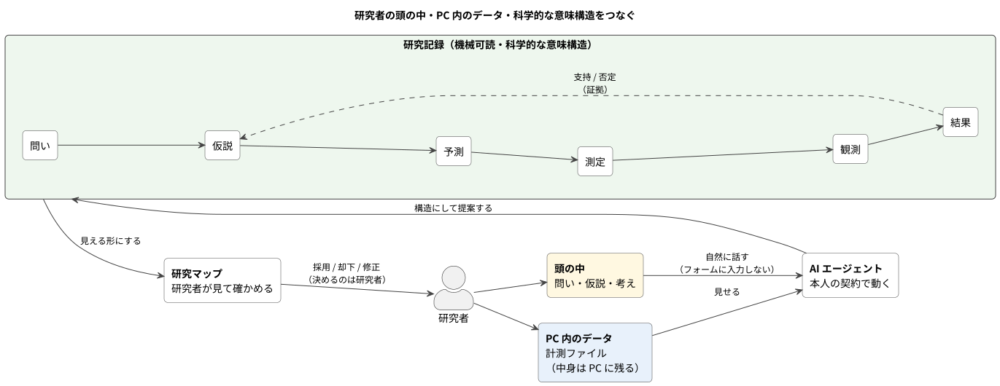

# コアコンセプト

## 1. コアビジョン（`Core Vision`）

rescicle は、研究者が AI エージェントと共同で研究を整理・記録し、問い（`Question`）・仮説（`Hypothesis`）・予測（`Prediction`）・測定（`Measurement`）・観測（`Observation`）・結果（`Result`）と、それらの間の証拠（`Evidence`）関係を機械可読な研究記録（`Research Record`）として残すための基盤である。

研究者はフォームへ入力しない。研究について自然に話し、実際のデータを扱う。エージェントがそれを構造化し、rescicle が研究マップ（`Research Map`）として可視化する。研究者は確認（`Confirm`） / 却下（`Reject`） / 修正だけ行う。



会話は研究マップと同じ窓の会話欄で行う。alpha（デスクトップ版、Tauri）は研究者がサインイン済みの `claude` CLI を 1 ターンごとに起動し、返ってきた `{ reply, operations, read_files }` を rescicle が 1 件ずつ検証して記録に書く（D-112）。Claude Code 側からは MCP でも同じ記録を読み書きできる。

alpha が扱う型は問い・仮説・予測・測定・データ（`asset`）の 5 つで、観測・結果・証拠はまだない（[05-data-model.md](05-data-model.md) の「alpha の実装範囲」）。

基本価値は、

> **研究者の頭の中・PC 内のデータ・科学的な意味構造をつなぐこと**

である。

---

## 2. 立ち位置: 人間と既存の科学インフラ（`Scientific Infrastructure`）の間にエージェント（`Agent`）を置く

rescicle は新しい Science Ontology を発明するプロジェクトではない。

機械同士をつなぐ Open Science 標準はすでに存在する。

| 標準 | 役割 |
| --- | --- |
| PROV-O (W3C) | 来歴（`Provenance`）（Entity / Activity / Agent） |
| RO-Crate | 研究成果とその文脈を JSON-LD で束ねる Research Object |
| Nanopublication | Assertion + Provenance + Publication info の最小単位 publication |
| ORCID | 研究者の永続識別子 |
| DataCite | データセット / Research Object の識別と引用メタデータ |

しかし普通の研究者が日々これらを手で書くことは不可能である。

そこで rescicle は、

> **人間と既存 Scientific Infrastructure の間にエージェントを置き、研究者が意識せず日常的にこれらの標準を生成できるようにする**

という位置を取る。

```text
Existing scientific infrastructure
   ├ PROV-O
   ├ RO-Crate
   ├ Nanopublication
   ├ ORCID
   └ DataCite
          ↑ interoperable mapping (export / publish)
Research Record Specification (RRS)
          ↑ implements
       rescicle（マップ + 会話欄。デスクトップアプリ）
          ↑
Researcher ↔ Agent（claude CLI。Claude Code から MCP でも可）
```

内部モデルは小さく単純に保ち、エクスポート（`Export`） / 公開（`Publish`）時に既存標準へ写像する。内部を RDF や JSON-LD にはしない。

---

## 3. 標準と製品の名前を分ける

Git と GitHub のように、標準と製品は別名にする。

| 名前 | 対象 |
| --- | --- |
| **Research Record Specification (RRS)** | 公開標準（`Open Standard`）。データモデル・Exchange Format・Agent Interface・Compatibility Rules。v0.1 の時点では草案 |
| **rescicle** | 製品・サービス・ネットワーク（`Network`）のブランド。RRS の参照実装（`Reference Implementation`） |
| **rescicle compatible** | RRS に準拠し、rescicle の互換性テスト（`Compatibility Test`）も通る製品認証マーク。RRS が草案を脱してから |

標準を rescicle 商標で囲い込まない。他の Lab Tool、エージェント、装置メーカー、出版社が RRS を実装できる。

```text
OtherLabTool  ─ implements RRS
OtherAgent    ─ implements RRS
rescicle      ─ implements RRS (reference)
```

---

## 4. 論文（`Paper`）ではなく研究記録（`Research Record`）を中心にする

```text
従来:  Research Activity → Paper → Review → Publication

rescicle:  Research Activity → Research Record → (View 生成) → Paper / Presentation / Dataset / Report
```

論文は Science そのものではなく、**研究記録の人間向けビュー（`View`）** となる。

---

## 5. ローカルファースト（`Local-first`） = 暗黙のデータ送出なし（`No Implicit Data Egress`）

「DB がローカルにある」だけではローカルファーストではない。エージェントがクラウド LLM なら、会話とデータはプロバイダへ出ていく。

原則は、

> **ユーザーの明示したポリシーなしに研究情報を端末外へ送らない。**

### エージェント実行モード

```text
A. LOCAL ONLY
   Local DB + Local files + Local model
   → 端末外送信なし

B. BYOK CLOUD
   Local DB → 必要最小限の context → ユーザー自身の契約（alpha は Claude Code。将来は他の MCP 対応エージェントや API key も）
   → 契約も費用もユーザー側

C. ORGANIZATION MANAGED
   Local / Lab DB → Institution-approved AI gateway
   → Enterprise / University 向け
```

### 外向きポリシー（`Egress Policy`）（プロジェクト単位）

alpha の送出範囲（会話モード）:

```text
Provider:          研究者本人の Claude Code 契約（claude CLI）
File metadata:     送る（相対パス・サイズ・更新日時、最大 120 件）
File contents:     AI が read_files で名前を挙げたファイルだけ、研究フォルダの内側から先頭 4KB を送る。
                   読んだものはすべて events に file_read として記録し、ファイル画面に「読み込み済み」と出す
Research objects:  要約を送る（問い・仮説・予測・測定・つながり、測定の実施状態）
Web:               AI が書いた検索語と URL が外に出る（WebSearch / WebFetch だけを許可）
```

Node 版は `Raw files: DENY` と許可リスト（allowed_roots）で「先に許可してから読む」形だった。alpha は、どのファイルが要るかは事前に分からないので、**許可の関所の代わりに「何が出ていったかを後から必ず見られる」記録**を置く（D-112）。

**これは Enterprise 機能ではなく Core 仕様である。**

alpha の会話モードでは、エージェントは研究フォルダではなく rescicle のエージェント用ディレクトリで動き、ファイルを触るツールを 1 つも持たない（許可は WebSearch / WebFetch だけ、テストで固定）。ファイルの中身が届く経路は rescicle が読む 1 本だけなので、Core がエージェントの唯一の経路になっている。一方、Claude Code から MCP で使う構成では、エージェントが rescicle を迂回してファイルや DB を直接読むことを Core は防げない。エージェント指示（`Agent Instruction`）と Claude Code 側の権限設定で補う。

### 注意: 個人契約のエージェントと BYOK API は別物

個人サブスクリプションで動くエージェント（Claude Code の Pro / Max など）は個人向けの規約に従い、商用 API とはデータ保持・学習利用・安全監視の条件が異なる。alpha は Claude Code を使うため、まず Claude Code の利用時のデータ条件を確認し、外向きポリシーの前提として文書化する（[07-decisions.md](07-decisions.md) U-02）。対応するエージェントごとに同じ確認をする。「クラウド AI なら安全」とは抽象化せず、rescicle 自身が送信範囲を制御する。

### MVP では rescicle が推論費を負担しない

```text
Free rescicle + 研究者本人の契約のエージェント（alpha は Claude Code）/ BYOK
```

---

## 6. エージェント中心 / 研究コパイロット（`Research Copilot`）

エージェントの仕事は転記ではない。現在の研究記録を材料に、

* 問いを明確化する
* 代替仮説（`Alternative Hypothesis`）を考える
* 予測を導出する
* 仮説を区別できる識別予測（`Discriminating Prediction`）と、それを検証する計画測定（`Planned Measurement`）を考える
* 欠けている証拠や分からないことを指摘し、そのオブジェクトの補足（`note`）として残す（D-109、D-115）

ところまで行う。

ただし、**エージェント提案（`Agent Proposal`）と確認済みレコードを混ぜない。** 全レコード（RRS Record）は由来（`origin`）（researcher / agent / instrument / ...）と状態（`status`）（proposed / confirmed / rejected / archived）を持つ。

```text
Question Q1
├─ Hypothesis H1        RESEARCHER   confirmed
│    └─ Prediction P1
├─ Hypothesis H2        AGENT        proposed
└─ Hypothesis H3        AGENT        proposed
```

**会話が入力 UI、研究マップが確認 UI** である。

---

## 7. 公開標準（`Open Standard`） ≠ すべて無料公開

### 公開（RRS）

* Research Record Specification（データモデル）
* Exchange Format（インポート / エクスポート仕様。RO-Crate ベース）
* Basic Agent Interface（MCP / API の基本仕様）
* 互換性ルールと互換性テスト

alpha はまだどれも公開していない（リポジトリは UNLICENSED）。Agent Interface に当たるのは、会話モードの応答スキーマ（`src-tauri/src/response_schema.json`）と MCP のツール一覧（`src-tauri/src/mcp.rs`）で、どちらも alpha の内部仕様として扱う。

### 公式 rescicle 製品

* 研究コパイロット / 研究マップ / ローカルエージェント
* データ連携 / 自動取得
* 論文コパイロット / 共同研究 / 出版
* 検証 / 再現ネットワーク / 機関管理

> **標準は開く。体験・サービス・ネットワークで勝つ。**

---

## 8. 標準ガバナンスと分断防止

仕様は公開するが、Versioning・中核語彙・互換性テスト・参照実装・拡張ルールのガバナンスは rescicle Project が持つ。

```text
RRS
 ├─ Core Specification      （小さく保つ）
 ├─ Domain Extensions       （rrs-physics / rrs-chemistry / rrs-biology / rrs-clinical）
 ├─ Compatibility Test      （機械的に検証）
 └─ Reference Implementation（rescicle）
```

Fork や独自実装は敵ではない。RRS を使っていればエコシステムが広がっている。防ぐのではなく、`rescicle compatible` で同じネットワークへ接続可能にする。

---

## 9. 事業の中心はネットワーク（`Network`）とサービス

ローカルソフトウェアはコピーされやすいが、ネットワークはコピーしにくい。

```text
Local rescicle → Selective Publish → rescicle Network
```

ネットワークには研究記録 / 仮説 / 証拠 / プロトコル / 再現 / 査読 / 訂正 / 研究者識別子 / 機関識別子が接続され、Science Graph が形成される。

```text
Scientific Claim C1
├─ Original Evidence
├─ Replication: Lab A
├─ Replication: Lab B
├─ Failed Replication: Lab C
├─ Review
└─ Correction
```

### Git / GitHub 型

| 相当 | rescicle |
| --- | --- |
| Git | RRS + ローカル rescicle Core（研究者がデータを所有。他社も互換実装できる） |
| GitHub | rescicle Network（共同研究 / 識別子 / 発見 / 検証 / 出版 / 査読 / 再現 / アーカイブ） |

---

## 10. 事業モデル（`Business Model`）

**最初の Wow の瞬間に必要なものはすべて Free。** 境界は「頼めばやってくれる」か「頼まなくてもやってくれる」か。

### Free / ローカル

研究について話したら研究マップができて、PC 内のデータとつながる、まで。

* ローカル研究記録 / 研究マップ
* 研究者本人の Claude Code との連携（会話モードと MCP。他のエージェントと BYOK は後）
* 会話 → 構造（問い / 仮説 / 予測 / 測定）
* エージェント提案
* Folder 選択 / 基本ファイル発見 / 基本メタデータ検査
* 測定連携
* インポート（`Import`） / エクスポート（alpha は JSON の書き出しだけ。D-127、U-05）

alpha は配布物を 1 つしか持たず、この区分はまだ製品に現れていない。

### Pro（時間を継続的に節約する部分）

* 自動取得 / バックグラウンドエージェント / 自動セッション検出
* 高度な来歴
* 研究記録からのレポート / 進捗まとめ生成（Pro の最初の候補。U-12）
* 論文コパイロット / 日次研究まとめ
* マネージド AI クレジット
* クラウドバックアップ / 同期
* 長時間にわたる分析支援

### Lab

* Lab 共有メモリ / チーム共同研究 / 共有研究マップ
* 権限 / 研究アセット管理 / 共有エージェント

### Institution / Enterprise

* プライベートデプロイ / オンプレミス / SSO / 監査 / コンプライアンス
* AI プロバイダ制御（Mode C）/ 機密研究制御 / 機関アーカイブ

### ネットワーク（`Network`） / 出版

* 長期ホスティング / 公開研究記録 / 検証 / 査読
* 出版サービス / 永続識別子（DataCite） / 高度な発見

---

## 11. 装置連携 / 出版社

装置が `Export as RRS Measurement` に対応すれば、測定レコードが直接研究記録へ入る。公式 rescicle は SDK / Validation / 認証を提供する（B2B）。

出版社は排除しない。保存 / 査読調整 / 編集 / 認証 / 発見 / Curation / アーカイブを分離し、出版社は「研究記録の中から価値の高い研究を選択・評価・編集する主体」になれる。ネットワークはゲートキーパーを必要としないが、Curation と認証には価値が残る。

---

## 12. 参入障壁（`Moat`）と脱ロックイン

競争優位は LLM ではない。Claude でも GPT でもローカルモデルでもよい。

資産は、

```text
RRS + Reference implementation + Official UX + Research integrations + Science Network + Compatibility ecosystem
```

一方でユーザーの研究データを人質にしない。研究者は常に研究記録 / アセット / 関係をエクスポートできる（RO-Crate）。

> **出られないから使うネットワークではなく、参加すると価値が高いから使うネットワーク。**

---

## 13. 事業の順番

最初から Science ネットワークを作らない。

```text
1. Individual Utility   （Research Copilot / Research Map / Measurement linking）
2. Adoption             （研究者が実際に使う）
3. Research Record accumulation
4. Lab collaboration
5. Publish / Share
6. Science Network
```

最初の顧客は「科学出版を変えたい人」ではなく **「自分の研究を整理したい人」**。

---

## 14. 製品の約束

> **研究について話してください。rescicle がその構造を整理します。**

> **あなたの PC にあるデータを、その研究上の意味とつなぎます。**

将来的には、

> **研究そのものを記録しておけば、論文・共有・再現・査読は後から生成できます。**

---

## 15. コアコンセプト

> **rescicle は、AI エージェントとの対話を通じて科学研究を構造化するローカルファーストの研究コパイロットであり、既存の Open Science 標準群と相互運用する Research Record Specification をオープンにする。一方で、最高品質の研究コパイロット、研究室向け機能、出版・検証・再現・発見を提供する rescicle Network を事業として構築する。**

短く言えば、

> **公開研究記録標準 + 公式研究コパイロット + Science ネットワーク**

### コンセプト 3 つ（価値デザインモデル、D-65）

本書で並列に語ってきた要素を、ビジョンに近づくための 3 つのコンセプトに絞る。残りはその実現手段として下に置く。

alpha との差: C1 のラベル（H1 など、D-81）は alpha にまだない。C2 の「履歴は上書きされない」も alpha は満たしていない — 却下は 3 分後に削除、線は物理削除、残るのは `events` の痕跡だけで、どう直すかは保留（D-110）。

| コンセプト | 内容 | 吸収する要素 |
| --- | --- | --- |
| **C1 会話が入力、マップが確認。同じものを同じ名前で指す** | 研究者はフォームに入力しない。話すと構造が見え、確認・却下だけする。会話で呼んだ名前（H1）がマップにもそのまま出る（D-81） | エージェント中心（§6）、提案と確認済みの分離 |
| **C2 記録は研究者の手元にあり、出るのは研究者が許した情報だけ** | ローカルファースト = 暗黙の送出なし。仮説と証拠の履歴は上書きされない | Egress Policy（§5）、不変リビジョン |
| **C3 記録は閉じない** | 開かれた仕様で書き出せ、既存の科学標準へ写像でき、ネットワークで価値が増える | 公開標準（§2〜3、§7）、証拠は関係、ネットワーク事業（§9） |

ビジョン（§14 の最後の約束）、言葉（§14 の最初の約束）、意味（§2）、コンセプト（本節）、ストーリー（04 §7）の対応は design/rdra/value-model.puml に図示する。

Octopus のような一次研究記録（`Primary Research Record`）との境界と、Research Working Environment としての勝ち筋は [03-positioning.md](03-positioning.md)（D-90）に固定する。「公開サイトを自前で勝つ」山には登らない。
