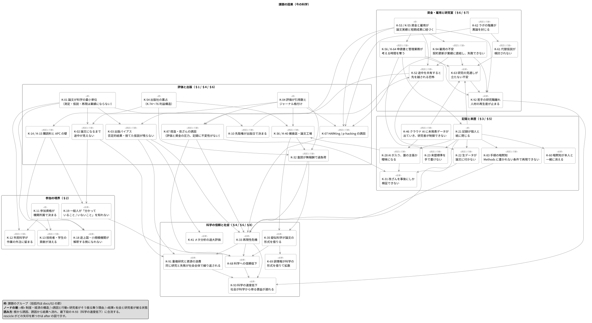
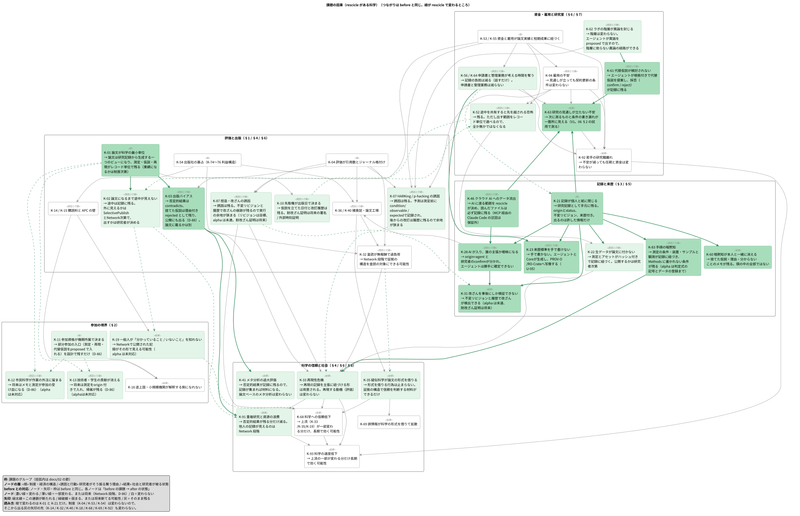

# 科学世界の課題

rescicle が置かれる科学世界の課題を、rescicle に関係するかどうかにかかわらず広く列挙する。[01-concept.md](01-concept.md) が「何を作るか」、[04-business.md](04-business.md) が「なぜ売れるか」を扱うのに対し、本書は「何が壊れているか」の棚卸しである。

各項目に K-番号（課題）を付け、他の docs から参照できるようにする。S は [design/rdra/requirement-model.puml](../design/rdra/requirement-model.puml) の戦略要求が使うので避ける。「rescicle との関係」は次の 4 値で表す。

| 値 | 意味 |
| --- | --- |
| 直接（v0.1） | v0.1（一人のローカル DB、研究者本人のエージェント経由）の設計がその課題に効く。v0.1 は Node 版の版番号で、alpha（v0.0.x）の現状もこの段階に当たる |
| 直接（蓄積後） | 設計は課題に効くが、効くのは記録が溜まった後、または公開 / ネットワーク段階（[04 §3](04-business.md) の段階 3〜6）。v0.1 では記録を残せるだけで、残す動機や外から見える経路はまだない |
| 道を残す | v0.1 では扱わないが、設計で拡張の道を残している（例: [D-86](07-decisions.md)） |
| 効かない | 制度・経済・文化の問題で、rescicle 単体では変えられない。制度が変わったときに受け皿になれるまで |

図は before / after の 2 枚ある。課題の因果連鎖（今の科学）は [design/rdra/problem-causal-model.puml](../design/rdra/problem-causal-model.puml)、同じノードと矢印のまま各ノードの中身を「rescicle があるとどうなるか」に書き換えたものが [design/rdra/problem-causal-model-after.puml](../design/rdra/problem-causal-model-after.puml)（生成物は `design/generated/rdra/`）。2 枚を重ねて、何が変わり何が変わらないかを見る。図に載せるのは因果の幹になる項目だけで、全項目は載せない（幅の制約。載せていない項目は本書の表が正）。本書の表が正で、図は図示（D-65）。

§1〜§11 には数字や固有の事例は書かない。課題の構造だけを書き、根拠（政府統計・公的調査・研究者の自由記述）は §12 に集める。

---

## 1. 単位と評価（`Unit and Evaluation`）

科学の最小単位が論文（`Paper`）であることから派生する課題。

| 番号 | 課題 | rescicle との関係 |
| --- | --- | --- |
| K-01 | 論文が科学の最小単位で、測定 1 件・仮説 1 つ・再現 1 回は業績にならない | 直接（蓄積後） |
| K-02 | 論文になるまで研究は外から見えず、「今どの仮説が争われているか」は常に数年遅れる | 直接（蓄積後） |
| K-03 | 出版バイアス。否定的結果、失敗した再現、途中で捨てた仮説が記録に残らない | 直接（蓄積後）。否定的結果は confirmed + `contradicts`、捨てた仮説は statement 付き rejected として公開に含める（[D-88](07-decisions.md)） |
| K-04 | 評価指標が引用数とジャーナル格付けに偏り、データ提供・再現・否定的結果・ツール開発が評価されない | 効かない |
| K-05 | 貢献役割の分類（CRediT など）は存在するが評価に使われず、著者順に貢献が埋もれる | 道を残す |
| K-06 | 「論文の数」が評価されるので、1 つの研究が細切れに出版される（サラミ出版） | 効かない |
| K-07 | 華々しい結果が評価されるので、仮説を後から結果に合わせる（HARKing）、都合のよい分析を選ぶ（p-hacking）誘因が構造的に存在する | 直接（蓄積後） |
| K-08 | 論文は「問いから結論まで一人が通しでやる」形式で、途中の思考（なぜその仮説を捨てたか）を書く場所がない | 直接（v0.1）。却下時の statement がその置き場で、公開にも出る（[D-88](07-decisions.md)） |
| K-09 | 学際研究は分野ごとの評価制度のどこにも収まらず、評価されにくい | 効かない |
| K-10 | 研究の「速さ」が評価されず、先取権（`Priority`）が論文出版日で決まるので、途中の共有が損になる | 道を残す |
| K-78 | 新規性偏重。追試・確認研究・否定的結果は「新しくない」ので業績にならず、誰もやらない | 効かない |
| K-79 | マタイ効果。実績のある人と機関に資金と引用が集中し、若手と無名機関が構造的に不利になる | 効かない |
| K-80 | データ・ソフトウェア・プロトコルの引用は識別子（DataCite など）があっても評価に換算されない | 効かない |
| K-81 | 査読と出版に 1 年以上かかり、成果が世に出る頃には研究は先へ進んでいる | 道を残す |
| K-82 | 論文の量が読める量を超え、分野内でも追えない。重複研究と見落としが増える | 道を残す |

## 2. 参加資格と境界（`Access and Boundary`）

誰が科学に参加できるかを所属が決めていることから派生する課題。

| 番号 | 課題 | rescicle との関係 |
| --- | --- | --- |
| K-11 | 投稿・査読・データベース利用・学会参加が機関所属を前提にし、独立研究者・企業技術者・アマチュアに入口がない | 道を残す |
| K-12 | 市民科学（`Citizen Science`）が「作業の外注」に留まり、参加者は問いを持てず、労働力として扱われ、帰属も薄い | 道を残す |
| K-13 | 測定担当の技術者、学生、共同研究先の担当者の貢献が著者情報から消える | 道を残す |
| K-14 | 論文の購読料が一般人と資金のない機関を締め出す | 効かない |
| K-15 | オープンアクセスの掲載料（APC）が今度は資金のない研究者を締め出す | 効かない |
| K-16 | 識別子が研究者にしかない。ORCID は所属と研究歴を前提にし、研究者以外の参加者を指せない | 道を残す |
| K-17 | 英語が事実上の共通語で、非英語圏の研究者は執筆・査読・発見のすべてで不利になる | 道を残す |
| K-18 | 途上国・小規模機関は装置も購読もなく、データを出す側にはなれても解釈する側になれない | 効かない |
| K-19 | 科学的知識が論文の形式でしか流通せず、一般人が「分かっていること / いないこと」を知る手段がない | 道を残す |
| K-20 | 専門用語と形式が参入障壁になり、内容を理解できても発言できない | 直接（蓄積後） |

## 3. 記録と来歴（`Record and Provenance`）

研究の記録が個人と紙に閉じていることから派生する課題。

| 番号 | 課題 | rescicle との関係 |
| --- | --- | --- |
| K-21 | 実験ノートが個人依存で、ラボを離れると文脈が失われる | 直接（v0.1） |
| K-22 | 生データが論文に付かない。「請求があれば提供する」が履行されない | 直接（蓄積後） |
| K-23 | 来歴（`Provenance`）の標準（PROV-O、RO-Crate）は存在するが研究者が手で書けず、普及しない | 直接（蓄積後） |
| K-24 | 電子実験ノート（ELN）はフォーム入力が前提で、仮説と証拠の構造を持たず、書くこと自体が負担 | 直接（v0.1） |
| K-25 | ファイル名と保存場所が個人ルールで、他人はもちろん本人も数年後に見つけられない | 直接（v0.1） |
| K-26 | 装置の出力形式が装置固有で、同じ分野でもラボ間で共有できない | 直接（蓄積後） |
| K-27 | 解析コードとデータと結果の対応が残らず、図をどう作ったか再構成できない | 直接（v0.1） |
| K-28 | AI が研究に入り、「誰が何を主張したか」が曖昧になり始めている。人の判断と AI の提案を分ける記録の仕組みがない | 直接（v0.1） |
| K-29 | データ管理計画（DMP）が書類として要求されるが、実際の運用と乖離している | 直接（蓄積後） |
| K-30 | 長期保存の責任が曖昧で、研究者の退職・機関のシステム更新でデータが消える | 道を残す |
| K-31 | 研究記録が改ざん不可能な形で残らず、不正の疑いが出たときに事後的にしか検証できない | 直接（v0.1） |
| K-83 | 手順の暗黙知。Methods に書かれない操作のコツ・試薬ロット・環境差で再現できず、再現失敗が「不正」か「条件差」か区別できない | 直接（v0.1） |
| K-84 | 学生も研究者も記録法とデータ管理の訓練を受けておらず、記録の質が個人の習慣に依存する | 直接（v0.1） |
| K-85 | 成果物が PDF で、機械が主張・証拠・数値を読み取れない。図から数値を戻せない | 直接（蓄積後） |
| K-86 | データの利用条件（ライセンス）が指定されず、公開されていても再利用できない | 道を残す |

## 4. 信頼と品質（`Trust and Quality`）

信頼の担保が査読しかないことから派生する課題。

| 番号 | 課題 | rescicle との関係 |
| --- | --- | --- |
| K-32 | 査読（`Peer Review`）が無報酬で過負荷、不透明で、再現性を検証する仕組みではない | 道を残す |
| K-33 | 再現性危機（`Reproducibility Crisis`）。再現は業績にならないので誰もやらず、失敗した再現は公表されにくい | 直接（蓄積後） |
| K-34 | プレプリントと査読済み論文の違いが一般人に伝わらず、途中段階の主張が「科学的事実」として広まる | 道を残す |
| K-35 | 疑似科学が論文の形式を借りて流通する。信頼の根拠が形式（掲載誌）にあり、証拠の構造にない | 直接（蓄積後） |
| K-36 | 捕食学術誌（`Predatory Journal`）が論文の形式だけを売り、業績の見た目を作る | 効かない |
| K-37 | 撤回（`Retraction`）が引用に反映されず、撤回された論文が引用され続ける | 道を残す |
| K-38 | 訂正（`Correction`）の仕組みが重く、小さな誤りを直す動機がない | 道を残す |
| K-39 | 統計の誤用と検出力不足が常態化し、単一の研究結果が過大に扱われる | 効かない |
| K-40 | 論文工場（`Paper Mill`）と生成 AI による偽論文が査読を通過し、文献全体の信頼を下げる | 道を残す |
| K-41 | 「肯定的結果だけの文献」からメタ分析すると、効果が系統的に過大評価される | 直接（蓄積後） |
| K-42 | 査読者の匿名性が責任を曖昧にし、査読の質を評価する仕組みがない | 効かない |
| K-87 | 捏造・改ざんの誘因。評価と資金の圧力が意図的な不正を生み、記録の不変性がないので実行の余地が広い（K-07 は無意識寄り、本項は意図的） | 直接（蓄積後） |

## 5. インフラと相互運用（`Infrastructure and Interoperability`）

科学のインフラが分野・装置・機関ごとに分断されていることから派生する課題。

| 番号 | 課題 | rescicle との関係 |
| --- | --- | --- |
| K-43 | 分野ごとの語彙が違い、分野横断で仮説や証拠を突き合わせる基盤がない | 道を残す |
| K-44 | データリポジトリが乱立し、同じデータがどこにあるかを見つけられない | 道を残す |
| K-45 | 機関の生成 AI ポリシーとデータ持ち出し規則が研究者ごとに違い、外部ツールを入れられない | 直接（v0.1） |
| K-46 | クラウド AI を使うと未発表データがプロバイダに出ていき、それを制御する手段が研究者にない | 直接（v0.1） |
| K-47 | 研究ソフトウェアが研究者の片手間で作られ、保守されず、再現に必要な環境が消える | 効かない |
| K-48 | 標準（オントロジー、メタデータスキーマ）が多すぎて、どれを使うかで分断される | 直接（蓄積後） |
| K-49 | 機械可読な科学的主張の基盤（Nanopublication など）は存在するが、生成する人がいない | 直接（蓄積後） |
| K-50 | 装置メーカーがデータ形式を囲い込み、装置を替えると過去データが読めなくなる | 道を残す |
| K-51 | 学術情報の検索が論文単位で、「この条件で測った人はいるか」を探せない | 直接（蓄積後） |

## 6. 動機と経済（`Incentive and Economy`）

共有する動機が個人になく、経済構造が公共性と一致しないことから派生する課題。

| 番号 | 課題 | rescicle との関係 |
| --- | --- | --- |
| K-52 | 途中の仮説やデータを出すと先を越される恐怖がある。共有は個人の損で科学全体の得という構造的不一致 | 道を残す |
| K-53 | 資金配分が論文実績に紐づき、研究者は記録や共有に時間を割けない | 効かない |
| K-54 | 出版社の寡占。公的資金の研究成果を公的に読めず、著作権が出版社に渡る | 効かない |
| K-55 | 任期付き雇用が短期成果を強い、長期的・探索的・否定的な研究を選べない | 効かない |
| K-56 | 研究費の獲得競争が研究時間を奪い、申請書と報告書の作成が本業を圧迫する | 直接（蓄積後） |
| K-57 | 企業研究は公開しないので、同じ失敗が社会全体で繰り返される | 道を残す |
| K-58 | 研究インフラ（データ基盤、ソフトウェア）に予算が付かず、論文にしかならない | 効かない |
| K-59 | 研究者の評価が個人単位で、共同研究の貢献配分が争いになる | 道を残す |
| K-74 | 出版社の利益構造。執筆・査読・編集は研究者の無償労働で、公的資金が研究者の給与と購読料の両方を払い、出版社が高い利益率を取る | 効かない |
| K-75 | 二重取り（`Double Dipping`）。ハイブリッド誌が購読料と APC の両方を取り、転換契約（`Transformative Agreement`）が大手の地位を固定する | 効かない |
| K-76 | ビッグディール契約で雑誌を束ねて売り、機関は不要な雑誌ごと買うしかなく、個別に解約する交渉力を失う | 効かない |
| K-77 | 出版社が論文から研究者の行動データ・分析・評価サービスに軸足を移し、囲い込みが論文からインフラと評価指標に広がる | 道を残す |
| K-88 | 資金申請時に成果を予想させるので探索研究ができず、申請書に書いた通りの結果を出す圧力が生まれる | 効かない |
| K-89 | 特許と公開の緊張。出願前の公開制限が共有を止め、産学連携では記録の帰属が争点になる | 道を残す |
| K-91 | 重複研究と資源の浪費。否定的結果・企業研究・隣の分野の成果が見えず、同じ研究と同じ失敗が社会全体で繰り返される | 道を残す |

## 7. 人と文化（`People and Culture`）

研究者の働き方と文化から派生する課題。

| 番号 | 課題 | rescicle との関係 |
| --- | --- | --- |
| K-60 | 研究者の頭の中にしかない知識（暗黙知、失敗の記憶）が本人と一緒に消える | 直接（v0.1） |
| K-61 | 「他の説明はないか」を議論する相手が近くにおらず、代替仮説（`Alternative Hypothesis`）が検討されないまま進む | 直接（v0.1） |
| K-62 | ラボ内の階層（PI と学生）が異論を封じ、確証バイアスが強化される | 直接（v0.1） |
| K-63 | 研究者の精神的負荷が高く、「研究の見通しが立たない」不安が常態化している | 直接（v0.1） |
| K-64 | 研究者の時間が管理業務と書類作成に奪われ、考える時間が減っている | 直接（v0.1） |
| K-65 | 失敗を語る文化がなく、失敗が共有されないので学べない | 道を残す |
| K-66 | 分野間の交流が乏しく、隣の分野で解決済みの問題を知らずに取り組む | 道を残す |
| K-67 | 研究者が科学者であると同時にコミュニケーター・管理者・営業を兼ねる無理 | 効かない |
| K-90 | パラダイム固着。分野の権威と査読者が既存の枠に合わない仮説を封じ、異論が出版に届かない | 道を残す |
| K-92 | 若手の研究職離れ。任期・資金・見通しの不安が重なり、博士課程進学と研究職への定着が減る。人材の再生産が止まる | 効かない |
| K-94 | 雇用の不安。若手 PI と任期付き研究者は契約更新が業績に直結し、「失敗できない」「探索できない」心理が日常化する。研究の不安（K-63）とは別に、生活の不安として研究行動を歪める | 効かない |

## 8. 科学と社会（`Science and Society`）

科学と社会の接点から派生する課題。

| 番号 | 課題 | rescicle との関係 |
| --- | --- | --- |
| K-68 | 科学への信頼が低下し、「専門家」の主張が他の意見と同列に扱われる | 道を残す |
| K-69 | 誤情報が科学の形式（グラフ、引用、専門用語）を借りて拡散する | 道を残す |
| K-70 | 科学の不確実性（分かっていないこと）を伝える方法がなく、「科学は変わる」が「科学は信用できない」と受け取られる | 道を残す |
| K-71 | 政策決定と科学的証拠の接続が弱く、証拠の強さを政策側が評価できない | 効かない |
| K-72 | 教育で科学が「答えの集合」として教えられ、「問いと証拠の過程」として教えられない | 道を残す |
| K-73 | 研究の社会的影響（`Impact`）が事後にしか測れず、研究者が自分の研究の意味を説明できない | 効かない |
| K-93 | 科学の速度低下。再現性危機・資源の浪費・人材流出が重なり、社会が科学から得る便益が遅れる | 効かない |

---

## 9. 匠メソッドとの接続（`Value Analysis`）

匠メソッドの連鎖は V（価値ストーリー）→ P（企画側の目的）→ S（戦略要求）→ Q / B（要求）→ F（要件）→ M（活動）で、正本は [04 §7](04-business.md) と [design/rdra/](../design/README.md)。本書の課題はその上流にあり、「ステークホルダーが今どう困っているか」から V を導く材料になる。V は「得る状態」、K は「今の状態」で、K を裏返したものが V の候補になる。

### 9.1 既存の価値ストーリーが解く課題

| V | ステークホルダー | 解く課題 |
| --- | --- | --- |
| V1 | 若手 PI | K-21、K-25、K-60、K-63 |
| V2 | 若手 PI | K-61、K-62、K-07 |
| V3 | 若手 PI | K-08、K-27、K-56、K-83 |
| V4 | 若手 PI | K-46、K-89 |
| V5 | 若手 PI | K-10、K-31 |
| V6 | 学生 | K-13、K-62 |
| V7 | 指導教員 | K-62、K-21 |
| V8 | 大学 研究推進 | K-29、K-30 |
| V9 | 情報セキュリティ担当 | K-45、K-46 |
| V10 | 資金配分機関 | K-22、K-33、K-41、K-87 |
| V11 | 企業 R&D | K-46、K-57 |
| V12 | RRS 実装者 | K-23、K-48、K-49 |

### 9.2 価値ストーリーがまだない課題

「直接」「道を残す」と分類したのに、どの V にも対応しない課題。ステークホルダーが [design/rdra/stakeholder-model.puml](../design/rdra/stakeholder-model.puml) にいないか、いても V が書かれていない。V の候補として置き、段階が来たら 04 §7 に昇格させる。

| ステークホルダー（候補） | 課題 | V の候補 |
| --- | --- | --- |
| 一部分だけを担う専門家（装置を持つ技術者、測定担当、共同研究先） | K-05、K-13、K-16、K-59 | 自分の測定が来歴付きで残り、誰の仮説に効いたかが見える |
| 再現する人 | K-01、K-33、K-37 | 再現の成否がそのまま記録になり、主張者と別人として帰属される |
| 代替仮説を出す人（異分野の研究者） | K-61、K-66、K-43 | 専門外の研究に「別の説明」を proposed として置け、採否が残る |
| 興味を持つ一般人 | K-19、K-20、K-34、K-70、K-72 | 「分かっていること / いないこと」を、論文を読まずに構造として見られる |
| 科学コミュニティ（査読・再現・訂正） | K-32、K-35、K-38、K-40 | 信頼の根拠を掲載誌ではなく証拠の構造に置ける |
| 装置メーカー | K-26、K-50 | 装置の出力が RRS Measurement として直接記録に入る |
| 若手 PI（既存だが V がない） | K-02、K-03、K-51、K-52 | 途中の仮説を先取権を失わずに共有できる。「この条件で測った人はいるか」を探せる |

一般人と部分参加者の行は [D-86](07-decisions.md) の 3 制約が前提。ステークホルダーモデルの「科学コミュニティ 低」「装置メーカー 低」はそのままで、V の候補だけ持っておく。

## 10. rescicle との関係の集計

| 関係 | 項目 |
| --- | --- |
| 直接（v0.1） | K-08、21、24、25、27、28、31、45、46、60〜64、83、84 |
| 直接（蓄積後） | K-01〜03、07、20、22、23、26、29、33、35、41、48、49、51、56、85、87 |
| 道を残す | K-05、10〜13、16、17、19、30、32、34、37、38、40、43、44、50、52、57、59、65、66、68〜70、72、77、81、82、86、89〜91 |
| 効かない | K-04、06、09、14、15、18、36、39、42、47、53〜55、58、67、71、73、74〜76、78〜80、88、92〜94 |

「直接（v0.1）」は 3（記録と来歴）と 7（人と文化）に集中し、1（単位と評価）と 4（再現性）はすべて「直接（蓄積後）」である。とくに K-01 / K-03 / K-07 は、v0.1 のリビジョンと origin が HARKing や捨てた仮説を**事後に判別できる記録**を作るだけで、研究者が確認画面で都合の悪い仮説を rejected / archived にする動機までは変えない。記録できることと実際に残すことは別で、後者は評価制度と公開経路（段階 5〜6）に依る。なお alpha はまだリビジョンを持たず、却下したものは 3 分後に消える（`events` に痕跡だけ残る）。捨てた仮説を残すことに依る「直接（v0.1）」の判定（K-03 / K-08 など）は、alpha ではまだ成り立っていない（D-110 で保留）。after の因果図（problem-causal-model-after.puml）はその段階まで進んだときの姿であり、v0.1 の因果ではない（2026-09-04 のレビューで分離）。「道を残す」は主にネットワーク（`Network`）段階と部分参加（[D-86](07-decisions.md)）に対応する。「効かない」は評価制度と経済構造で、rescicle が受け皿になっても制度側の変化がなければ動かない。ここは [04 §3](04-business.md) の Institution ティア（研究公正・データ管理義務）のように、制度が変わる方向に賭ける形で扱う。

## 11. 使い方

* 新しい機能や設計判断を docs に書くとき、それがどの S-番号に効くかを添える
* 顧客インタビュー（[04 §2](04-business.md)）で聞いた課題を、この表のどれに当たるか、または新項目かで分類する
* 「効かない」に分類した項目が制度側で動いたら（評価制度の改定、DMP の義務化など）、関係を見直す

## 12. 研究現場の声と公的調査（`Field Evidence`）

§1〜§11 は課題の構造だけを書いた。本節はその根拠で、政府統計・公的調査・研究者の自由記述から、研究現場で実際に何が痛いかを集める。調査日は 2026-09-26。

結論を先に書く。

* 現場の悲鳴は「時間・お金・人」に集中している。研究時間の不足、基盤的経費の目減り、物価高、雇用の不安定さ、支援人材の不足である
* 「記録が残らない」「データ管理が大変」は、研究者が自分から口にする痛みとしてはほとんど出てこない。自由記述で 1% 前後である
* ただし記録の喪失は、外から測ると大きい。論文のデータは年ごとに消え、「請求があれば提供する」と書いた著者の大半は応じない
* つまり rescicle が効く課題（K-21、K-60、K-83）は、研究者に「痛い」と自覚されていない。売り文句は「記録を残す」ではなく、自覚された痛み（時間を返す、人が抜けても研究が止まらない）の側から言う必要がある

### 12.1 政府統計と公的調査

#### 12.1.1 研究時間（K-64、K-56）

文部科学省「大学等におけるフルタイム換算データに関する調査」（5 年ごと、令和 5 年度調査は 2025-01-31 公表、回答 8,377 人）。教員の職務時間のうち研究に使えた割合は次のとおり。

| 年度 | 2002 | 2008 | 2013 | 2018 | 2023 |
| --- | --- | --- | --- | --- | --- |
| 教員の研究活動時間割合 | 46.5% | 36.2% | 35.0% | 32.9% | 32.2% |

注意点がある。理学・工学・農学では 2008 年度以降ほぼ横ばいで、全体の減少は保健分野（教員の 36%、研究時間割合 28.8%）が大きく引っ張っている。「全分野で研究時間が減り続けている」とは言えない。分野別の 2023 年度は理学 48.0% が最も高い。

同調査で「研究パフォーマンスの制約」として最も多く挙がったもの。

| 区分 | 最も多い制約 |
| --- | --- |
| 研究人材 | 修士・博士課程学生の不足 |
| 研究時間 | 大学運営業務（教授会などの学内会議）。学内事務手続きはその半分程度 |
| 研究環境 | 研究機器・試料を活用・維持するための研究補助者・技能者の不足 |
| 研究資金 | 基盤的経費の不足 |

NISTEP 定点調査 2025（2025-09〜2026-01 実施、1,826 人回答、2026-04-24 公表）では、「研究時間を確保するための取組（Q204）」の指数が大学の自然科学研究者全体で 2.5（0〜10、2021 年から -0.3）。報告書の区分で「著しく不十分」の境界にあり、大学グループ第 2G・第 3G は著しく不十分。大学の基礎研究強化で優先すべきことの上位は「研究時間割合の増加」と「研究に専念できる研究者数の増加」だった。

海外も同じ構造である。米国 Federal Demonstration Partnership の Faculty Workload Survey では、連邦研究費の PI が研究時間のうち管理業務に使う割合が 2005 年 42%、2012 年 42.3%、2018 年 44.3% と下がっていない。

#### 12.1.2 お金と物価高（K-53、K-58）

NISTEP 定点調査 2025 の深掘調査で、研究者とマネジメント層の約 9 割が物価高騰等の影響があると答えた。

| 属性 | 最も多い影響 | 割合 |
| --- | --- | --- |
| 大学の自然科学研究者 | 消耗品費 | 55% |
| 同上 | 旅費 | 51% |
| 人文・社会科学の研究者 | 旅費 | 78% |
| マネジメント層 | 光熱費・設備維持費、人件費 | 各 45% |

2021 年から「研究基盤」「基盤的経費の確保」「競争的資金等の確保」の指数が大きく低下した。緩和策の上位は、物価に連動した基盤的経費と競争的研究費の追加配分である。

#### 12.1.3 人と雇用（K-55、K-92、K-94）

* 修士から博士課程への進学者は過去 15 年でおよそ 3 分の 2 に減った（文部科学省資料）
* 国立大学の 39 歳以下の任期なし正規ポスト比率は 2007 年度 23.4% から 2016 年度 15.1% に下がった（内閣府資料）
* NISTEP 定点調査 2025 で「望ましい能力を持つ博士後期課程進学者の数（Q105）」は、多くの属性で「著しく不十分」
* 理化学研究所では 2023 年 3 月、10 年ルールを前に研究者の雇い止めが起きた。労働組合の集計で対象 203 人のうち 97 人。研究室主宰者の雇い止めでチームごと解散する例も出た
* 改善の兆しもある。若手研究者の自立、博士課程進学の環境、博士のキャリアパスは 2021 年から長期的に上昇した

#### 12.1.4 研究データ管理（K-22、K-29、K-30）

NISTEP「研究データ公開と研究データ管理に関する実態調査 2024」（2024-11〜12、1,237 人回答）。

| 項目 | 割合 |
| --- | --- |
| 公開データを入手した経験 | 85.3% |
| 自分の研究データを公開した経験 | 66.1% |
| DMP を作った経験 | 39.7% |

データ公開は雑誌ポリシーに押されて進んでいる。公開しない理由には評価制度がないことが挙がり、人材・時間・資金の不足も感じている。機関側（JPCOAR ほか 2024 年度）では、データポリシーの策定・検討率が 70.8% に達した一方、機関リポジトリで研究データを実際に公開した事例は 26.9% にとどまる。

#### 12.1.5 記録は外から測ると消えている（K-21、K-22、K-30、K-33）

研究者の自覚とは別に、記録の喪失は定量的に確かめられている。

* Vines ら（Current Biology、2014）は 516 本の論文にデータを請求した。データが現存する見込み（オッズ）は、出版から 1 年ごとに 17% ずつ下がった
* Gabelica ら（Journal of Clinical Epidemiology、2022）では、「データは請求に応じて提供する」と書いた 1,792 本のうち 93% の著者が無回答か提供を断った
* Nature の 2024 年調査（生物医学の研究者 1,600 人超）では、約 4 分の 3 が再現性の危機があると考え、最大の原因に「出版圧力」を挙げた
* 日本では、研究不正の調査で実験ノートや生データが残っていないと、疑いを晴らせず不正と認定されうる。日本学術会議は 2015 年に、実験ノート・生データを論文発表後 10 年保存する方針を示した

#### 12.1.6 文化とメンタル（K-63）

Wellcome の研究文化調査（2020、約 4,000 人）。

| 項目 | 割合 |
| --- | --- |
| 研究コミュニティで働くことに誇りを持つ | 84% |
| 研究職のキャリアを安心して続けられる | 29% |
| 激しい競争が不親切で攻撃的な環境を生んだ | 78% |

### 12.2 自由記述に出る研究者の声

#### 12.2.1 データ

NISTEP 定点調査は 2021〜2025 年の自由記述をすべて Excel の検索用データベース（NISTEP REPORT No.210 付属の `TEITEN2025DataBase.xlsb`）で公開している。18,588 件、約 175 万字。回答者は第一線の研究者と大学・国研のマネジメント層、企業の代表者で、無作為の研究者全体ではない。

テーマごとに語で当て、その年の記述件数に対する割合を数えた。深掘調査のテーマが年ごとに違う（2024 は博士人材、2025 は物価高）ので、その年だけ跳ねる項目がある。

| テーマ | 2021 | 2022 | 2023 | 2024 | 2025 |
| --- | --- | --- | --- | --- | --- |
| 研究時間・雑務 | 5.8% | 4.5% | 6.8% | 6.2% | 7.0% |
| 申請書・報告書 | 4.4% | 1.6% | 5.4% | 2.9% | 3.9% |
| 任期・雇用不安 | 5.3% | 2.1% | 1.9% | 1.5% | 1.3% |
| 博士・学生減少 | 5.6% | 2.7% | 1.6% | 13.2% | 2.3% |
| 技術職員・支援人材 | 3.1% | 2.3% | 3.7% | 1.7% | 3.3% |
| 評価・論文数偏重 | 3.4% | 2.9% | 1.9% | 1.2% | 1.9% |
| 挑戦・探索できない | 4.6% | 1.7% | 1.5% | 1.1% | 2.7% |
| 物価・円安 | 0.8% | 1.3% | 2.7% | 2.3% | 14.3% |
| 装置・設備 | 5.1% | 2.5% | 2.7% | 1.9% | 8.1% |
| 基盤的経費 | 2.9% | 1.0% | 1.8% | 1.8% | 10.3% |
| 記録・データ管理 | 1.8% | 0.6% | 1.0% | 0.7% | 0.5% |
| 継承・暗黙知 | 0.8% | 0.5% | 0.3% | 0.4% | 0.3% |
| 再現性・研究公正 | 1.2% | 0.4% | 0.7% | 0.9% | 0.4% |
| AI | 0.6% | 0.3% | 0.8% | 0.6% | 0.9% |
| 記述件数 | 2,427 | 3,961 | 3,235 | 3,324 | 5,641 |

語の当て方は粗く、「記録」「ノート」は研究記録以外にも当たる。それでも記録・継承・再現性は、時間・お金・人と比べて 1 桁少ない。

#### 12.2.2 代表的な声（原文、2023〜2025）

**時間と書類**（K-56、K-64）

> 少ない原資を取り合うのではなく、全体を増やして当選率を上げて欲しい。審査も相当大変。あらゆるしくみが乱立し、申請だけでなく審査だけでも研究時間が削られる。（2025、大学、教授、工学）

> 大型の競争的研究費を獲得することで、評価対応に多くの時間をとられる傾向が強まっている。長期プロジェクトや未来社会貢献のような事業だとしても、短期的な成果を求め、毎年のように報告を求められる。（2025、重点プログラム、准教授）

> 研究費使用に関して、会計システムが導入された。研究者がWebで使用金額を入力、納品・請求・見積もり書類のPDF化してアップロード、10万円を超える装置類の発注は研究者が行い、相見積もりや装置カタログを入手してアップロードするなど、負担が劇的に増えた。（2023、重点プログラム、准教授）

> 申請書・報告書の作成などに多く時間を割かれ、本来進めるべき研究がおろそかになるため、特に申請書の作成時間は、別個に調査するべきだと思います。（2023、大学、助教・研究員、工学）

**人が抜けると技術が消える**（K-21、K-60、K-83）

> 技術補佐員や，優秀な事務補佐員，研究員などスタッフの確保が課題であり，資金面に加えて人材の募集が極めて難しい．流動的な学生が主なためノウハウ継承が困難であり，技術教育，実験室の保守などアドミン業務で日中の業務時間を消耗している状況である．（2025、重点プログラム、助教・研究員）

> 研究者は事務や管理業務に時間を取られ、技術スタッフなど支援スタッフも減らされる一方である上に、技術の伝承も行われにくい人事体制（人の入れ替わりが激しい）になっている。（2024、大学、教授、農学）

> 研究補助者、テクニカルスタッフの雇止めを止めてほしい。（中略）技術を持っている人を大事に育て、捨てない、人は宝とするお金の流れが必要。使い捨てでは人は育たない。（2025、大学、教授、保健）

> 既に我々の分野では、若手の研究者が非常に少なくなってしまっており、現在は助教の公募をかけても該当者なし、となるケースが珍しくない。知識の継承という意味では、手遅れになりつつある（2023、重点プログラム、准教授）

**雇用と挑戦**（K-55、K-94）

> 10年以上、雇用が数年後に終了するような研究環境で、落ち着いて挑戦的な研究ができるわけがない。（2025、重点プログラム、准教授）

**物価高**

> ここ2年ほどで、基本的な消耗品の価格は全て高騰し（約3倍）、一方で競争的資金や大学からの経費は基準が変わっていない。（中略）本来ならば行えるはずだった実験や出張などが制限されている状況である。（2025、大学、助教・研究員、理学）

**研究公正の対策が時間を奪う**（K-31、K-87）

> 起きる前の事前対策に割く労力や時間が、大きすぎる。（中略）その他の不正（利益相反や研究不正も）は起きる前提で、起きた場合に厳罰に処すことを考え、善良な多くの研究者の時間を奪うのは再検討して頂きたい。（2025、大学、准教授、工学）

> 研究インテグリティの前提となっている知識が古くなっており、抜本的な更新が必要となっているが、更新の取り組みを推進するインセンティブがないため、問題である。制度自体も形骸化している。（2025、重点プログラム、教授）

**AI への期待と疑問**（K-28）

> 生成AIがとても良い作文をできる能力を持っている今、現状のやり方を継続することには疑問を感じる.（2025、大学、教授、理学。競争的研究費の書類作成について）

> AIによる書類作成が行われてしまう現代において，研究費獲得のための評価を提出された書類に基づいて行うことが妥当なやり方なのか疑問に感じることがある．（2025、大学、教授、工学）

> AIを使い始めてみると、海外に比べて日本が極端に遅れていることがよくわかってきて、愕然とする機会が多い。（2025、国研、教授）

報道で拾われた声もある。准教授の小野悠氏は「いま仕事時間の中で、自分自身の研究に本当に集中できるのは、1割くらい」「中国や韓国の研究者と話していても、『え、そんなことまで自分でやっているの？』と驚かれます」と話した（Yahoo! ニュース エキスパート、市川衛、2023-10-07）。理研の雇い止めで提訴した研究者は「野球チームが解散し、監督1人残った状態」と述べた（東京新聞）。

### 12.3 rescicle への含意

| 観察 | 含意 |
| --- | --- |
| 研究者が自覚する痛みは時間・お金・人で、記録は 1% 前後しか語られない | 「研究記録が残る」は刺さりにくい。「書類と引き継ぎに取られる時間を返す」「人が抜けても研究が止まらない」の側から言う |
| 研究環境の最大の制約は研究補助者・技能者の不足。学生は流動的でノウハウ継承が難しい、という声がある | K-60 / K-83（暗黙知、手順のコツ）は、人の入れ替わりという自覚された痛みとして語れる。技術職員・学生の卒業・雇い止めが入口になる |
| 申請書・報告書・評価対応が時間を削る。AI で書類を作る時代に書類審査は妥当か、という疑問が出ている | K-56 の「直接（蓄積後）」は、溜まった記録から報告書や申請書の下書きを出せるかに掛かる。これは研究者が最も欲しがっている方向と一致する |
| 研究公正の事前対策が「善良な研究者の時間を奪う」と受け止められている | K-31 は「新しい義務」に見えると反発される。追加の手間なしに、話しただけで記録が残る形でないと受け入れられない |
| 外から測ると記録は年 17% のオッズで消え、請求への提供は 1 割未満 | Institution ティア（[04 §3](04-business.md)）の根拠。研究者本人より、研究公正・データ管理を担う機関側に響く数字 |
| 物価高で消耗品・旅費すら削られている | 有料化の相手は個人研究費ではなく、機関や企業の予算になる可能性が高い |

限界。NISTEP 定点調査の回答者は第一線の研究者と管理職で、若手や学生、企業の技術者は薄い。rescicle の最初の利用者に近い「計測データを扱う現場の技術者・大学院生」の声は、これらの調査では拾えない。[04 §2](04-business.md) の顧客インタビューで直接聞く必要がある。

### 12.4 出典

* 文部科学省「令和 5 年度 大学等におけるフルタイム換算データに関する調査（概要）」2025-01-31 <https://www.mext.go.jp/content/20250418-mxt_chousei01-000040124.pdf>
* 科学技術・学術政策研究所「科学技術の状況に係る総合的意識調査（NISTEP 定点調査 2025）」NISTEP REPORT No.209 / 210、2026-04 <https://www.nistep.go.jp/archives/62733/>、報告書 <http://hdl.handle.net/11035/0002000291>、データ集と自由記述 DB <http://hdl.handle.net/11035/0002000292>
* 科学技術・学術政策研究所「研究データ公開と研究データ管理に関する実態調査 2024」調査資料-352 <https://www.nistep.go.jp/archives/62211/>
* 日本経済新聞「試薬費や旅費が高騰、研究者の9割「影響」 文部科学省調査」2026-04 <https://www.nikkei.com/article/DGXZQOSG23ALQ0T20C26A4000000/>
* 日本経済新聞「大学教員の8割「研究時間不足」 文科省の研究所が調査」2024-05 <https://www.nikkei.com/article/DGXZQOUE261QP0W4A520C2000000/>
* 文部科学省「博士後期課程修了者の進路について」2023-01 <https://www8.cao.go.jp/cstp/tyousakai/hyouka/haihu144/144_honpen3.pdf>
* 内閣府「若手研究者をとりまく３つの課題（参考データ）」2020-05 <https://www5.cao.go.jp/keizai-shimon/kaigi/special/reform/wg7/20200508/shiryou1-2_2.pdf>
* 東京新聞「あの理化学研究所で97人雇い止め」<https://www.tokyo-np.co.jp/article/252517>
* 市川衛「「研究時間は全体の1割」日本の若手研究者が直面する、厳しすぎる現状」Yahoo! ニュース エキスパート、2023-10-07 <https://news.yahoo.co.jp/expert/articles/d5388c7b08b72d84f3390336d5a03614c67333af>
* 日本学術会議「回答 科学研究における健全性の向上について」2015-03-06 <https://www.scj.go.jp/ja/info/kohyo/pdf/kohyo-23-k150306.pdf>
* Federal Demonstration Partnership, 2018 Faculty Workload Survey <https://thefdp.org/wp-content/uploads/FDP-FWS-2018-Primary-Report.pdf>
* Wellcome, What researchers think about the culture they work in, 2020 <https://wellcome.org/press-release/largest-survey-research-culture-reveals-high-levels-stress-and-insecurity>
* Nature, 'Publish or perish' culture blamed for reproducibility crisis, 2024 <https://www.nature.com/articles/d41586-024-04253-w>
* Vines et al., The Availability of Research Data Declines Rapidly with Article Age, Current Biology 2014 <https://www.cell.com/current-biology/fulltext/S0960-9822(13)01400-0>
* Gabelica et al., Many researchers were not compliant with their published data sharing statement, Journal of Clinical Epidemiology 2022 <https://www.sciencedirect.com/science/article/abs/pii/S089543562200141X>

自由記述の集計の再現: `TEITEN2025DataBase.xlsb` の「自由記述」シートを `pyxlsb` で読み、12.2.1 の表のテーマごとに正規表現で当てて年ごとに数える。引用は集計グループ 1〜4（現場の研究者）から、60〜260 字の記述を無作為に抜いた。
