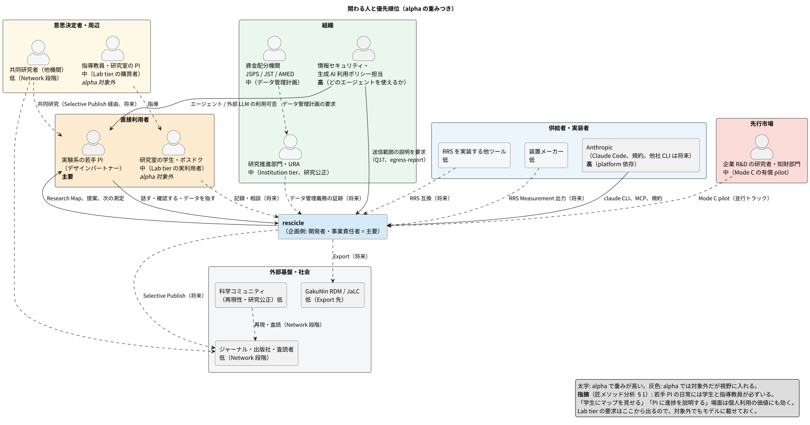
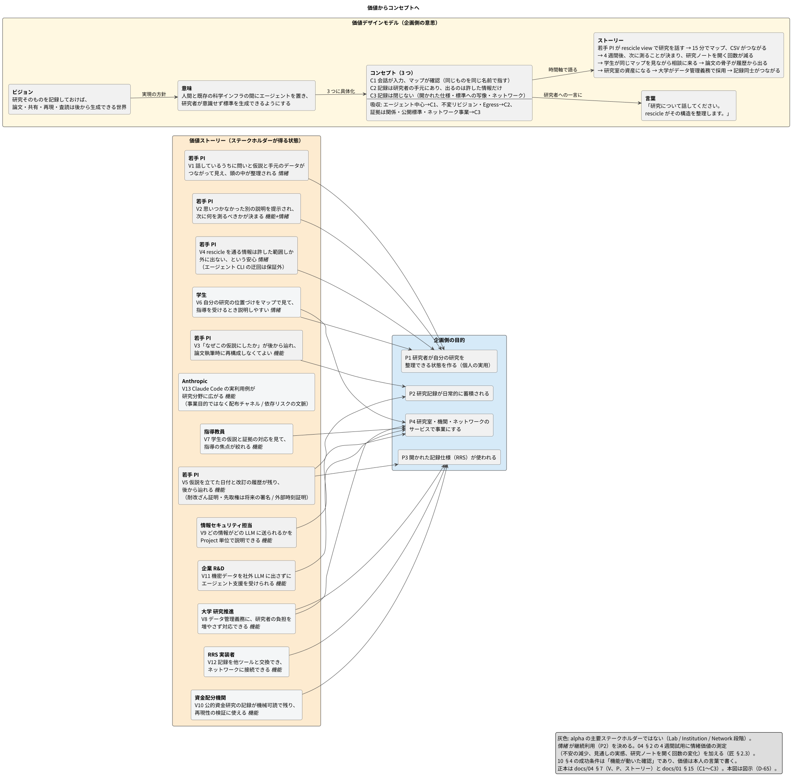
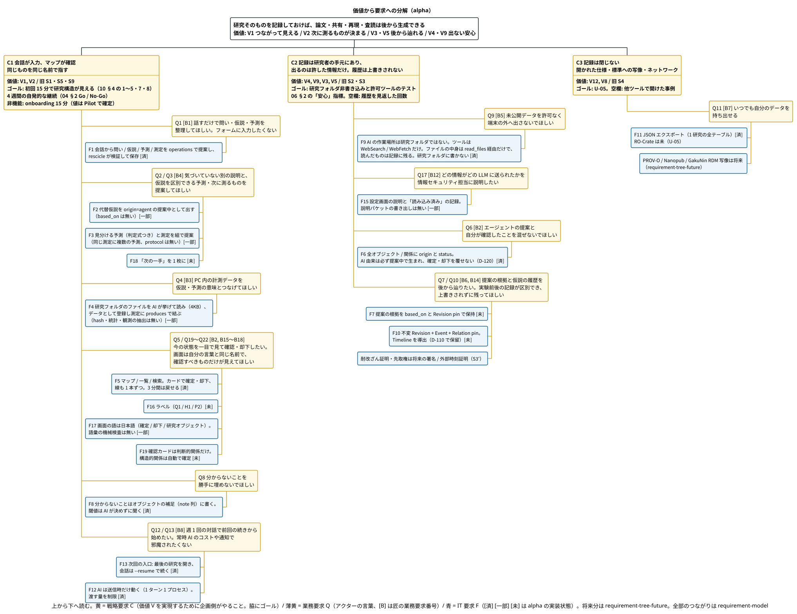
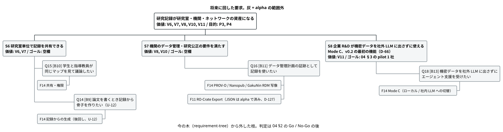

# 事業計画

[01-concept.md](01-concept.md) が「何を作るか」を定め、本書は「なぜ売れるか、誰に、いつ」を扱う。数値は仮説であり、パイロット（`Pilot`）とデザインパートナー（`design partner`）の結果で更新する。

---

## 1. なぜ自作や既存ツールではなく rescicle か

### 競合と代替手段

| 分類 | 例 | rescicle との関係 |
| --- | --- | --- |
| 一次研究記録（公開） | Octopus（Jisc / Octopus Publishing CIC） | 論文を分解して公開する Primary Research Record。rescicle と同じ山ではない。作業環境の出口候補（[03-positioning.md](03-positioning.md)、D-90） |
| ELN（電子実験ノート） | Benchling / LabArchives / eLabFTW / SciNote | 記録の入力先。フォーム入力が前提で、仮説（`Hypothesis`）と証拠（`Evidence`）の構造は持たない。将来のインポート（`Import`）元 |
| Open Science 基盤 | OSF（事前登録を提供）/ Zenodo / Dataverse | 公開・保存先。RRS からのエクスポート（`Export`）先であり、ネットワーク（`Network`）段階では競合にもなる |
| 国内研究データ基盤 | NII GakuNin RDM（OSF ベース）/ JaLC DOI | 機関側に予算がある領域。エクスポート先として名指しし、機関向けの売り文句にする |
| 汎用ツール + LLM | Notion / Obsidian に LLM を足した運用 | 最も現実的な代替。構造も来歴（`provenance`）も持たないが、導入は容易 |
| 文献系 AI | Elicit / Scite / Consensus | 文献側から入る。rescicle は手元のデータと仮説から入る。将来の文献エージェントの連携先 |
| 自作 | Claude Code の利用者が MCP + SQLite + グラフ表示を数日で組む | alpha の実体もこれに近い。差は次節 |

### 自作や「汎用ツール + LLM」との差

alpha の機能面の差は小さい。差が出るのは次の 3 点で、いずれも時間と設計の蓄積が要る。

1. **エージェント制約（`Agent Constraint`）**。規則をプロンプトではなく rescicle Core 側で強制する。alpha がいま強制しているのは、AI の応答を操作（operations）として 1 件ずつ検証してから書く、型の組で許される線を決める、予測は判定式（`criterion`）なしでは作れない、研究フォルダには 1 バイトも書かない、ファイルの中身は AI が名前を挙げたものだけを rescicle が読み、読んだことを必ず記録する、の 5 つ（[09-usecases.md](09-usecases.md) の「rescicle が守っている境界」、[06 §2](06-glossary.md)）。Node 版が決めていた「研究者の判断を AI が上書きできない」は D-120 で入れた。「内容変更はリビジョンで上書きしない」はまだ満たしていない（D-110 で保留）。自作ではプロンプトに頼りがちで、時間が経つと記録の信頼性が崩れる。
   機能を並べれば rescicle は「メモリ、ビュー、共有、ネットワーク」で、それは Claude のメモリとプロジェクト機能でも作れる。違いはメモリの中身で、エージェント制約が「モデルなしで第三者（他のラボ、機関、機械）が信用できる記録」を作る。制約は「モデルを信用しない」という製品の立場なので、モデルを売る側（[§5](#5-リスク) のベンダー本体の参入）が自ら作る動機は弱い。制約はモデル非依存で、Claude でも他のモデルでもローカルモデルでも同じに効く。効くのは rescicle Core を通る操作だけで、Claude Code の迂回は防げない（[01 §5](01-concept.md)）。
2. **既存標準への写像**。PROV-O / RO-Crate / Nanopub へのエクスポートを最初から設計に入れている。自作では後付けが難しい。
3. **計測データとの接続**。ファイル境界（研究フォルダの内側だけ）、データと測定の対応、読んだファイルの記録を決定論コア（`Deterministic Core`）が担う。ハッシュ、リビジョン、システム観測の抽出は alpha にはまだない。

「自分で作れる」人は最初の顧客ではない。最初の顧客は「Claude Code は使えるが、この設計を自分で維持したくない研究者」である。

---

## 2. 最初の顧客と検証計画

### 顧客の定義

* 分野: 実験系の物性・材料（Wow の例と同じ）。装置・条件・サンプルという測定（`Measurement`）の構造が明確で、CSV が日常的に出る。
* 職位: 博士課程〜ポスドク〜若手 PI。自分でデータを触り、Claude Code を導入できる（alpha は Claude Code 専用。D-119）。
* 除外: 計算科学（アセットが Notebook 中心で測定モデルが合わない）、臨床（規制が先に立つ）。v0.2 以降のドメイン拡張（`Domain Extension`）で扱う。

### 募集経路

* 最初のデザインパートナーは 1 名確定（固体物理 / 量子材料の実験系、若手研究を採択された単独 PI）。実名と連絡経路は非公開ファイルに置き、docs には書かない
* 同分野の近隣ラボから 2〜4 名を並行して当たり、計 3〜5 名（デザインパートナー）
* 物性・材料系の研究室 1 つを旗艦ラボとして獲得する。RRS にとっての「最初の大口ユーザー」に相当し、Lab ティアの要件もここから取る

### 2 段階の検証

| 段階 | 期間 | 目的 | 指標 |
| --- | --- | --- | --- |
| Wow 試験 | 15 分 × 1 回 | 「対話で研究構造が見える」が成立するか | [10 §4](10-first-user.md) の閾値 |
| デザインパートナー試用 | 4 週間、週 1 回の対話セッション | 継続して使うか | セッションあたりの確認済みレコード数、エージェント提案の採択率（confirm / reject 比）、4 週継続率（目標 3/5 名以上）、4 週目に自発的に研究マップ（`Research Map`）を開いたか、欠けていることのメモや条件の書き漏れが実際の次の測定につながったか |

試用の 1 回目は rescicle なしで研究内容を聞き取り、研究マップを手で書いて「構造化が価値になるか」を先に確認する。

デザインパートナー試用の Go / No-Go（仮の閾値。1 人目の結果で調整する）:

| 指標 | 閾値 |
| --- | --- |
| 4 週継続率 | 3/5 名以上が 4 週目もセッションを行う |
| エージェント提案の採択率 | confirm / (confirm + reject) が 30% 以上（低すぎれば提案の質、高すぎれば批判的に見ていない疑い） |
| 自発的なマップ再訪 | セッション外でビューを開いた週が 4 週中 2 週以上（3/5 名） |
| 欠けから実測へ | 欠けていることのメモ（条件の書き漏れを含む）または計画測定が実際の測定につながった例が参加者あたり 1 件以上 |
| 確認済みレコードの週次推移 | 4 週目が 1 週目を下回らない |
| 情緒価値（V1 / V4） | 各週の終わりに「研究の見通しが立っている」「未発表データの扱いに不安がない」を 5 段階で聞き、4 週目が 1 週目以上（3/5 名） |
| 研究ノートを開く頻度 | 1 週目と 4 週目の自己申告で減少（V1 の代理指標） |
| 離脱理由 | 継続しなかった参加者は理由を「価値がない / 手間 / 環境（エージェント・機関ポリシー）/ 時間」に分類して記録 |

継続率と採択率の両方を満たさなければ No-Go とし、原因をタイムライン（`Timeline`）とインタビューで特定してから次の試用に進む。

Wow 試験で閾値を超えなければデザインパートナー試用に進まない。試用の途中で「フォームより楽」が崩れたら、原因をタイムラインから追える。

### 顧客インタビュー

パイロット（[10 §4](10-first-user.md)）の前に、対象分野の研究者 5 名に次を聞く。当初は「コードより先」としたが、Node 版で M1〜M5 を先行させ（D-80）、その後 alpha に作り直した。インタビューは未着手。

* 測定データの実態: 装置と出力形式（CSV / テキスト / HDF5 / 装置固有バイナリ）、1 実験あたりのファイル数、命名規則。時系列 + パラメータスイープが CSV 統計だけで意味を持つか（U-13 に直結）
* 今、仮説と測定の対応をどこに記録しているか（ノート、電子ノート、Notebook、Slack、頭の中）
* 「他の説明はないか」を誰と議論しているか
* どのエージェントを使えるか（D-87、D-119）: Claude Code（他のエージェントも）の個人契約の有無、機関契約（ChatGPT Edu など）の有無、所属機関の生成 AI 利用ポリシー、未発表データを外部 LLM に送ることへの本人と機関の許容範囲（U-02 に直結）
* 仮説の粒度: 問い（`Question`） / 仮説 / 予測（`Prediction`）の分解を自然と感じるか（成功条件 7 の前提）
* 論文化のときに何を再構成しているか
* PC 内のデータをどう探しているか
* 協力の形: 週 1 回の対話セッションを 4 週間続けられるか。データ提供の範囲

項目 1 と 4 は、AI にファイルの何を読ませるか（alpha は先頭 4KB のテキストだけ）と U-02 の結論を左右するため、パイロットの前に必ず終える（元はマイルストーン（`Milestone`） 0 の項目）。

結果は `docs/interviews/` に日付付きで残す。参加者は ID（P1, P2 …）で呼び、所属・研究テーマの固有名詞・装置の型番は書かない（分野と所属で個人が特定されるため）。実名と連絡経路は `.review/`（gitignore）に置く（D-58）。

---

## 3. 収益化までの時間軸

[01 §13](01-concept.md) の 6 段階に期間と売上要素を付ける。

| 段階 | 期間（仮） | 売上要素 |
| --- | --- | --- |
| 1 Individual Utility | 〜3 か月 | なし。Free + 研究者本人の契約のエージェント / BYOK |
| 2 普及 | 3〜9 か月 | Pro の最初の機能: **研究記録（`Research Record`）からのレポート / 進捗まとめ生成**。時間節約が最も分かりやすく、レコード（RRS Record）が溜まるほど価値が上がる |
| 3 レコード蓄積 | 6〜12 か月 | Pro: 自動取得 / バックグラウンドエージェント。並行して企業 R&D 向けに Mode C の有償パイロット（v0.2 の最初の機能。Institution ティアの先行版。D-66） |
| 4 Lab 共同研究 | 9〜18 か月 | Lab ティア。旗艦ラボから |
| 5 公開（`Publish`） / 共有 | 12〜24 か月 | Institution ティア（研究公正・データ管理義務への対応） |
| 6 Science ネットワーク | 24 か月〜 | 出版 / 検証サービス |

論文コパイロットを証拠スライスより前に置く案は取らない。研究記録が薄いまま生成しても価値が出ない。ただしレポート生成はレコードがあれば安価に作れるので、Pro の最初の機能にする。

### 先行有料市場の候補

* **企業 R&D**。ローカルファースト（`Local-first`）と外向きポリシー（`Egress Policy`）、Mode C（機関承認済み AI gateway）は、海外 LLM へのデータ送信を懸念する組織にそのまま商品になる。学術より支払意思が高く、材料物性は相性がよい。
* **研究公正・データ管理義務**。公的資金研究のデータ管理計画とメタデータ付与が求められる流れに対し、不変リビジョン（`Immutable Revision`）と RO-Crate エクスポート、GakuNin RDM / JaLC DOI への接続を Institution ティアの売り文句にする。購買動機は「整理」より「不正防止・再現性」の方が強い。

どちらも設計の中核のうち外向きポリシー（policy の fail-closed、送信範囲の説明パケット）、不変リビジョンは Node 版で設計済みだが、alpha にはまだない（D-110）。JSON 書き出しは alpha にもある（D-127）。さらに売り物になるには次が要る: 企業 R&D には Mode C の機関承認ゲートウェイ、SSO、監査ログの集約。研究公正には RO-Crate エクスポート（M7、U-05）と GakuNin RDM / JaLC 接続。これらは v0.2 の開発項目であり、「追加開発なし」ではない（2026-09-04 のレビューで修正）。

---

### 価格・原価・粗利の仮説（D-59）

数値はすべて検証対象の仮説。デザインパートナーインタビューで支払意思を聞き、パイロット後に更新する。

| 項目 | 仮説 | 検証方法 |
| --- | --- | --- |
| Pro 単価 | 月額 2,000〜3,000 円（個人研究者。研究費で落とせる上限を意識） | インタビューで「月いくらなら研究費から払うか」 |
| API 原価（BYOK 以外） | 1 セッション 15 分で 50〜150 円（context 上限 D-20 の設計で抑える） | パイロットで実測 |
| マネージド AI クレジット | 原価 + 20% の再販。粗利は薄く、利便性で売る | Pro 利用者の BYOK 比率 |
| Pro の粗利下限 | 60%（API 原価と同期のストレージを引いた後） | 月次で計算 |
| Lab ティア | 5 名で月額 15,000〜25,000 円 | 旗艦ラボの PI に提示 |
| 企業 R&D（Mode C パイロット） | 導入 3 か月で 50〜150 万円、購買者は研究企画または情報システム部門、導入期間 2〜4 か月 | 1 社に提案して反応を見る |
| Institution | 年額。機関の研究データ管理予算から。単価は GakuNin RDM 関連の予算規模を調べてから | 大学の研究推進部門にヒアリング |

## 4. ライセンス（U-10）

ローカルファーストの信頼と RRS の普及には Core のオープンソース化がほぼ必須である。その場合 Pro を何で守るかを決める。

| 対象 | 案 |
| --- | --- |
| RRS 仕様 | CC BY 4.0。誰でも実装できる |
| rescicle Core（デスクトップアプリ / MCP サーバー / 決定論コア） | Apache 2.0 または MIT。参照実装（`Reference Implementation`）として公開 |
| Pro / Lab / Institution 機能 | 非公開（オープンコア）。自動取得、バックグラウンドエージェント、レポート生成、同期、Mode C gateway |
| ネットワーク | サービスとして提供。コードは非公開 |

守るのは「機能」ではなく、ネットワークと連携と運用である（[01 §12](01-concept.md)）。仮決めは Core が Apache-2.0、RRS 仕様が CC BY 4.0（D-80）。公開前に最終確認して U-10 を閉じる。

alpha のリポジトリはいま `UNLICENSED`（`package.json`）で、ソースは公開していない。配布しているのはインストーラだけ。

---

## 5. リスク

| リスク | 内容 | 対策 |
| --- | --- | --- |
| 特定ベンダーへのプラットフォーム依存 | alpha の配布先は Claude Code の契約者に限られる（D-119）。「15 分で Wow」は `claude` CLI のインストールとサインインが前提（MCP の登録は要らない）。U-02 の規約次第で外部送信の説明が変わる。フロンティア能力のアクセスがアカウント単位でゲートされ、安全監視でタスクが止まる傾向（OpenAI の Astra、2026-09）は、どのベンダーでも起こり得る。会話モードは `claude -p` の出力形式（stream-json）と `--resume` に乗るので、その変更は alpha 側の修正になる | 推論は本人の契約で、rescicle は枠だけ（D-89、D-112）。検証と書き込みは rescicle 側にあり、エージェントに依存しない。MCP サーバーは標準実装なので他のエージェントからも使える。自前 UI + BYOK の Agent Runtime か、他の CLI への対応（Codex など）を持つまで、この依存は解けない。Claude Code は検証と最初の配布経路であって唯一の経路にしない |
| ベンダー本体の参入 | Anthropic / OpenAI / Google が研究分野の製品を自前で出す（Anthropic は既に分野向け製品と文献・ELN 接続を持つ）。「話すと構造化される」体験は Claude のメモリとプロジェクト機能の延長で作れる。rescicle の Wow は Claude Code の上で動くので、価値の実証がそのままベンダーへの実演になる（V13 は両刃）。ELN ベンダーが AI を足す方向からも来る。取られやすいのは会話 → 構造、代替仮説の提案、確認 UI | 取られにくいものに投資する。ローカルファーストと外向きポリシー（データを受け取りたいベンダーの動機と逆）、ベンダー中立の RRS と PROV-O / RO-Crate への写像、決定論コアの不変条件、国内機関（GakuNin RDM / JaLC）との接続、ネットワーク。RRS は「置き換えるより採用した方が得な形式」にしておく（Git と GitHub の関係）。Core のモデル非依存（v0.2 の Agent Runtime）を競合対策としても前倒しする。「Claude にメモリが付いたもの」と同じに見える機能は作らない。ベンダー本体が構造的に入りにくい企業 R&D と Institution ティア（ベンダー中立を求める AI ポリシー）の優先度を上げる |
| 標準の採用がゼロから | Git は Linux カーネルという大口ユーザーがいて GitHub が乗った。RRS には他者が実装する動機がまだない | 旗艦ラボ、学会、ジャーナルのいずれかを「RRS にとっての最初の大口ユーザー」として計画に入れる。草案のうちは標準化より実利用を優先（D-34） |
| ネットワークへの投稿インセンティブ | 論文前にレコードを公開する動機はスクープの恐れに負ける | タイムスタンプ付きレコード（Nanopub 事前登録）を **先取権の証明** として位置づけ、公開せずに証明だけ得られる経路を先に作る |
| 競争優位が当面 UX だけ | ローカルソフトウェアはコピーされやすく、ネットワーク到達までの防御が薄い | 時間のかかる資産を早く積む。装置連携、分野別拡張、GakuNin RDM / JaLC 連携 |
| 収益化までが遠い | 1〜3 段階に売上がない | レポート生成を Pro の最初の機能に。企業 R&D を先行有料市場に |
| 商標 | RRS だけでなく製品名 rescicle とドメインも未調査 | U-04 の範囲を拡張 |

---

## 6. 追い風

* **研究データ管理の義務化**。公的資金研究のデータ管理計画とメタデータ付与が制度化され、機関側に予算がある。
* **研究公正**。再現性と不正防止は機関の購買動機として「整理」より強い。HARKing 対策の不変リビジョンはそのまま訴求点になる。
* **企業の LLM データ送信への懸念**。安全保障輸出管理や機密の観点で、外向きポリシーと Mode C は要件に直接応える。
* **エージェント環境の普及**。Claude Code などの CLI と MCP により、推論を自前で持たずにエージェント連携を配布できる。alpha の開発コストを大きく下げる。

---

## 7. 価値と戦略要求（D-65）

design/rdra/value-model.puml と requirement-model.puml の正本。番号は図と対応する。

### 7.1 価値ストーリー（ステークホルダーが得る状態）

| # | ステークホルダー | 価値ストーリー | 種類 | 企画側の目的 |
| --- | --- | --- | --- | --- |
| V1 | 若手 PI | 話しているうちに問いと仮説と手元のデータがつながって見え、頭の中が整理される | 情緒 | P1 |
| V2 | 若手 PI | 思いつかなかった別の説明を提示され、次に何を測るべきかが決まる | 機能 + 情緒 | P1 |
| V3 | 若手 PI | 「なぜこの仮説にしたか」が後から辿れ、論文執筆時に再構成しなくてよい | 機能 | P2 |
| V4 | 若手 PI | rescicle を通る情報は許した範囲しか外に出ない、という安心（エージェントによる迂回は保証外） | 情緒 | P1 |
| V5 | 若手 PI | 仮説を立てた日付と改訂の履歴が残り、後から辿れる（耐改ざん証明は将来） | 機能 | P2、P3 |
| V6 | 学生 | 自分の研究の位置づけをマップで見て、指導を受けるとき説明しやすい（将来） | 情緒 | P1、P4 |
| V7 | 指導教員 | 学生の仮説と証拠の対応を見て、指導の焦点が絞れる（将来） | 機能 | P4 |
| V8 | 大学 研究推進 | データ管理義務に研究者の負担を増やさず対応できる（将来） | 機能 | P3、P4 |
| V9 | 情報セキュリティ担当 | どの情報がどの LLM に送られるかを Project 単位で説明できる | 機能 | P4 |
| V10 | 資金配分機関 | 公的資金研究の記録が機械可読で残り、再現性の検証に使える（将来） | 機能 | P3 |
| V11 | 企業 R&D | 機密データを社外 LLM に出さずにエージェント支援を受けられる | 機能 | P4 |
| V12 | RRS 実装者 | 記録を他ツールと交換でき、ネットワークに接続できる（将来） | 機能 | P3 |
| V13 | Anthropic | Claude Code の実利用例が研究分野に広がる（配布チャネルと依存リスクの文脈。事業目的ではない） | 機能 | — |

企画側の目的: P1 研究者が自分の研究を整理できる状態を作る、P2 研究記録が日常的に蓄積される、P3 開かれた記録仕様（RRS）が使われる、P4 研究室・機関・ネットワークのサービスで事業にする。

### 7.2 戦略要求とゴール

| # | 戦略要求 | 由来する価値 | ゴール・指標 | 空欄 |
| --- | --- | --- | --- | --- |
| S1 | 初回 15 分で自分の研究構造を、自分の言葉と名前で読める形で見られる | V1、V2、V6 | 10 §4 の 1〜5、7、8。画面の語彙が 06 の日本語表示であること（機械検査、D-82。alpha は未実装）。パイロット参加者が H1 / P2 を指して話せたか（ラベルは alpha 未実装） | onboarding 時間の上限（S9） |
| S2 | rescicle Core を経由する情報は、許した範囲以外を端末外に出さない | V4、V9 | alpha のテスト `nothing_rescicle_does_writes_to_the_research_folder` と許可ツールの固定、「安心した」割合（§2 の情緒指標） | — |
| S3 | 仮説と証拠の履歴が上書きされず後から辿れる | V3、V5、V10 | alpha は未達（`events` の痕跡だけ。D-110 で保留） | 履歴を見返した回数 |
| S3' | 耐改ざん証明と先取権（将来。署名 / 外部時刻証明 / Nanopub） | V5 | — | すべて |
| S4 | 記録が既存標準へ写像でき、閉じない | V12、V8 | U-05 | 他ツールで開けた事例 |
| S5 | 4 週間以上、自発的に使い続ける | V1（情緒）、V3 | §2 の Go / No-Go | — |
| S6 | 研究室単位で記録を共有できる（将来） | V6、V7 | — | すべて |
| S7 | 機関のデータ管理・研究公正の要件を満たす（将来） | V8、V10 | — | すべて |
| S8 | 企業 R&D が機密データを社外 LLM に出さずに使える（Mode C、段階 3 と並行、v0.2） | V11 | §3 の pilot 1 社 | 最小製品境界 |
| S9 | 非機能: onboarding 15 分以内、MCP 応答 2 秒以内、DB 破損からの復旧、Project 1 万 Record | V1、V4 | 値は Pilot で確定 | 実測値 |

### 7.2b 画面から戻した業務要求（匠メソッド再訪 2026-09-03）

M1 の画面を価値ストーリーに照らして追加した要求。requirement-model の Q19〜Q22 と F16〜F19 に対応する。

| # | 要求（研究者の言葉） | 由来する価値 | 要件 |
| --- | --- | --- | --- |
| B15 | 会話で使った名前（H1、P2）が画面でも同じ名前で見える | V1、V6、C1 | F16 ラベル（D-81） |
| B16 | 画面は自分の言葉と日本語で書かれていて、述語や ID を知らなくても読める | V1、V6、言葉 | F17 語彙（D-82） |
| B17 | 「次に何を測るか」が一箇所にまとまって見える | V2 | F18 次の一手 |
| B18 | 自分が確認すべきものだけが、確認すべきものとして見える | V1、Q5 | F19 判断的関係だけを操作対象に |

### 7.3 ストーリー

若手 PI が rescicle の会話欄で研究のことを話す（裏で動くのは本人の Claude Code）。15 分で研究マップができ、手元の CSV がつながる。4 週間後、次に測るべきことが自然と決まり、研究ノートを開く回数が減る。学生が同じマップを見ながら相談に来る。論文を書くとき、仮説の履歴を辿るだけで方法と考察の骨子ができる。研究室が使い始め、記録が研究室の資産になる。大学がデータ管理義務への対応として採用し、記録は RO-Crate で外に出せる。やがて記録同士がつながり、再現と査読が記録の上で行われる。

## 8. 本書が閉じるべき未決事項

| 未決 | 本書での扱い |
| --- | --- |
| U-04 | RRS 名称に加え、製品名 rescicle とドメインの商標調査を含める |
| U-10 | 仮決め済み（Core は Apache-2.0、仕様は CC BY 4.0、D-80）。公開前に最終確認 |
| 新規 U-11 | デザインパートナーの募集経路と旗艦ラボの候補を確定する |
| 新規 U-12 | Pro の最初の機能をレポート生成にするか、デザインパートナー試用の結果で判断する |
