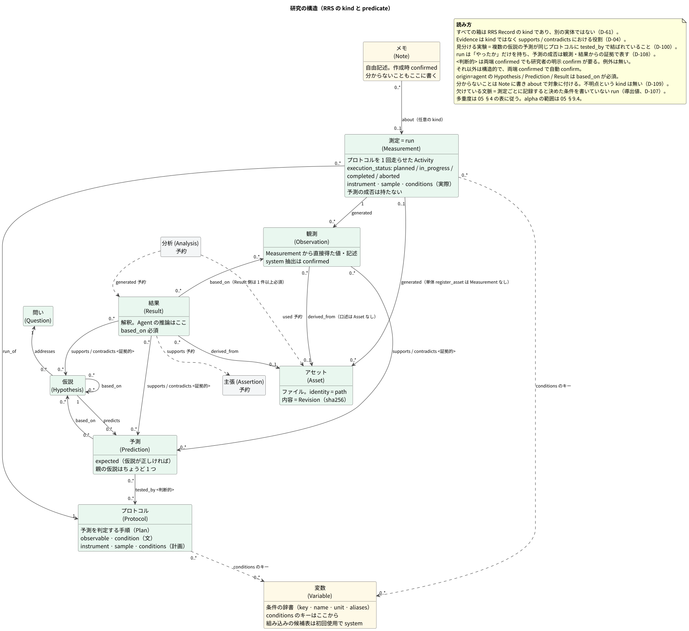
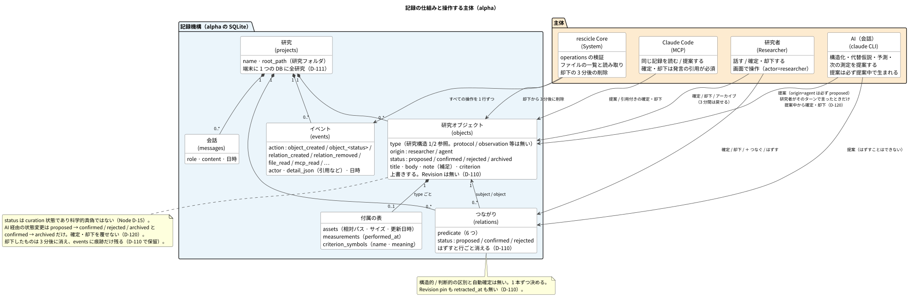
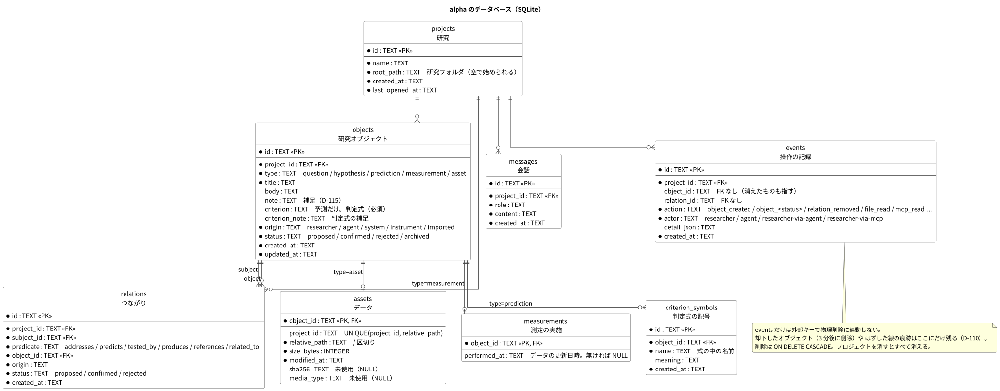

# データモデル

RRS の中核データモデル。内部表現は小さな関係モデルに保ち、エクスポート（`Export`）/ 公開（`Publish`）時に PROV-O / RO-Crate / Nanopublication へ写像する。

本書は 2 つに分かれる。§1〜§8 は **RRS の規定**（仕様の全体像。Node 版 v0.1 のときに書いたもので、RRS の草案として残す）。§9 は **alpha の実装範囲**（いまのデスクトップ版が RRS のどこまでを、どういう形で持っているか）。食い違うところは §9 が alpha の事実で、§1〜§8 は目指す形である。どちらに寄せるかは [07-decisions.md](07-decisions.md) の D-110 以降で決める。

---

## 1. 基本原則

1. **レコード（RRS Record）と関係（`Relation`）の Graph**。研究は一本道ではない。
2. **由来（`origin`）と状態（`status`）を全レコード / 関係が持つ**。エージェント提案（`Agent Proposal`）と確認済みレコードを混ぜない。
3. **不変なリビジョン（`Revision`）**。内容の変更は上書きせず、リビジョンを積む。実験前後・投稿前後を判別できる（HARKing 対策）。
4. **証拠（`Evidence`）は Node ではなく関係の役割**。`supports` / `contradicts` で表す。
5. **分からないことを無理に埋めない**。分からないことはメモ（`note`）として対象に `about` で付けて残す（D-109）。
6. **計算で確定できるものに AI を使わない**。hash・metadata・統計は決定論コア（`Deterministic Core`）が作る。

---

## 1.1 用語対応表（製品語彙 → RRS）

README や concept で使う製品語彙は、RRS では次の kind / 関係に対応する。UI・コンテキストビルダー（`Context Builder`）・エクスポートはこの表を規範とする。

| 製品語彙 | RRS |
| --- | --- |
| Question / Hypothesis / Prediction / Measurement | 同名の kind |
| Data / File | `asset` |
| Observation | `observation`（Measurement から直接得た値・記述） |
| Interpretation / Finding | `result`（Agent または研究者の解釈） |
| Evidence | kind ではない。observation / result / assertion が `supports` / `contradicts` の subject として果たす役割 |
| Claim | `assertion` |
| Missing Context | kind ではない。測定ごとに記録すると決めた条件を書いていない run（`missing_conditions`、導出値、D-107 / D-109） |
| Condition / Variable | `variable`。条件のキーの辞書（D-107）。run / protocol の `conditions` は変数の key で書く |
| Alternative Hypothesis | `hypothesis`（origin=agent、同じ Question に `addresses`） |
| Discriminating experiment | 複数の仮説の `prediction` が同じ `protocol` に `tested_by` で結ばれていること（D-100） |
| Protocol | `protocol`。予測を判定するための手順（D-98） |
| Run | `measurement`。プロトコルを 1 回走らせた事実と実施の状態（予定 / 実施中 / 完了 / 中断、D-108）。`run_of` でプロトコルを指す |
| Next Measurement | run（`measurement`）がまだ無い `protocol`（実施の状態が planned の run も予定だが、次回の入口の planned には数えない、D-108） |
| Confirm / Reject | status の遷移（record_events） |
| Correct / Edit | 新 Revision（status は proposed に戻る） |
| Research Map | RRS Record と Relation の Graph の現在 View |
| Timeline | revisions + events + relations から導出した履歴 |

## 2. レコードの種類（`kind`）



### 2.1 一覧

| kind | 種別 | 定義 | PROV-O |
| --- | --- | --- | --- |
| `question` | Entity | 研究上の問い | prov:Entity |
| `hypothesis` | Entity | 現象についての説明候補 | prov:Entity |
| `prediction` | Entity | 仮説が成立した場合に期待される観測 | prov:Entity |
| `protocol` | Plan | 予測を判定するための手順（どういう条件で測り、何を見るか。装置・試料・条件）。直せる（版が積まれる）。D-98 | prov:Plan |
| `measurement` | Activity | プロトコルを 1 回走らせた run（いつ・実施の状態・実際にどの装置・試料・条件で。予測の成否は持たない、D-108）。起きたことなので変えない | prov:Activity |
| `asset` | Entity | データの入れ物・成果物。CSV / TIFF / JSON / Notebook / PDF / binary。意味ではなく Artifact | prov:Entity |
| `observation` | Entity | 測定から直接得られた観測内容 | prov:Entity |
| `analysis` | Activity | 観測 / アセットを加工する Activity | prov:Activity |
| `result` | Entity | 分析によって得られた出力・要約された結果 | prov:Entity |
| `assertion` | Entity | 世界について表明された主張。外へ伝えるレイヤー | prov:Entity |
| `note` | Entity | 構造化されない自由記述。分からないことも note に書き、`about` で対象に付ける（D-109） | prov:Entity |
| `variable` | Entity | 条件の軸の定義（key・名前・値の種類・単位・別名）。条件の辞書（D-107） | prov:Entity |

### 2.2 各 kind の形式定義

#### question

プロジェクト（`Project`）の中で答えを求めている問い。プロジェクトは複数の問いを持てる。各問いには複数の仮説（`Hypothesis`）が `addresses` で接続する。

#### hypothesis

現象の説明候補。各仮説は作成時からちょうど一つの問い（`Question`）に属し、一つの問いに複数存在してよい（Question : Hypothesis = 1:N）。所属は `hypothesis --addresses--> question` で表す。エージェント（`Agent`）は同じ問いに代替仮説（`Alternative Hypothesis`）を積極的に提示する。

title は**否定しうる主張**として書く（D-83）。「〜が原因で〜が起きる」「〜は〜である」の形で、名詞句（「接触抵抗の変化」「〜の影響」）は仮説にしない。名詞句は真偽が定まらず、予測を導けず、確認が何を認めたのかも決まらない。文の内容の良し悪しは研究者が判断し、Core は判定しない。

例: 「25K 付近で材料 X 自体に相転移が起き、抵抗が不連続に変わる」

#### prediction

仮説が正しければ観測されるはずのこと。`predicts` で仮説から導かれ、`tested_by` でプロトコル（判定の手順）に接続する。

予測は `metadata.expected`（仮説が正しければどうなるか）を持つことを推奨する（RRS では任意の語彙、D-83 / D-98）。どういう条件で測るか（`condition`）と何を見るか（`observable`）は手順の話なので予測ではなくプロトコルが持つ。Node 版 v0.1 の Core は `expected` を必須にし、`condition` / `observable` が予測に付いていれば拒否した（alpha は代わりに判定式 `criterion` を必須にする。§9）が、どちらも実装の判断で、他実装や `origin=imported` の取り込みには要求しない。

**予測の親の仮説はちょうど 1 つ**（`hypothesis --predicts--> prediction` が 1 本、D-100）。予測は「その仮説が正しければこうなる」という文なので、複数の仮説が同じ実験について違うことを言うなら、それは仮説ごとの別の予測である。2 つ以上の仮説の予測が同じプロトコルに `tested_by` で結ばれていれば、その実験は仮説を**見分ける実験**になる。同じ結果を予測する仮説どうしはその実験では見分けられず、それもそのまま見える。旧 v0.1 の `discriminates` 関係と `metadata.expected_by_hypothesis` は廃止した。

例: 「同じ材料の別試料（`sample`）でも 25K 付近で抵抗が不連続に変わる」（expected: 25K 付近で不連続。どう測るかは T1 が持つ）

#### protocol（D-98）

予測を判定するための手順。「こうやる」を書く。

```text
metadata.condition   どういう条件で測るかの文（conditions が 1 つ以上あれば省略可、D-107）
metadata.observable  何を見るか（必須）
instrument / sample   装置・試料（計画値）
conditions            条件 { 変数の key: 値 | null }（計画値。null は「測定ごとに記録する」の宣言、D-107）
body                  手順の文（試料の準備、掃引、解析）
```

`conditions` のキーは変数（`variable`）の key か別名に限り、書き込み時に key へ正規化する。値は変数の value_type で検証する（quantity は数値・`{ min, max }`・別単位の `{ value, unit }`。単位は換算しない）。

`prediction --tested_by--> protocol`（判断的）で「この予測はこの手順で判定する」を表す。同じプロトコルを複数の予測が共有してよい（H1 の予測「X」と H3 の予測「Y」を同じ手順で見る = 見分ける実験、D-100）。プロトコルは直せる（新リビジョン）。run がまだ無いプロトコルが「これから測る計画」で、計画がデータに先行したことはレコードの作成順が示す（HARKing 対策）。

#### measurement（run）

プロトコルを 1 回走らせた事実。「こうやった」を書く。

```text
execution_status                  実施の状態: planned（予定）| in_progress（実施中）| completed（完了）| aborted（中断）（D-108）
started_at / ended_at
instrument / sample / conditions   実際に使ったもの。空ならプロトコルの値を継承したと読む（conditions は変数の key、D-107）
```

`measurement --run_of--> protocol`（構造的）で走らせた手順を指し、アセット（`Asset`）を `generated` する。旧 `measurement_session` と同義。同じプロトコルの run が並ぶことが再現（`reproduction`）の表現になる。

装置（`instrument`）/ 試料/ 条件（`conditions`）は研究者またはエージェントの申告であり、Core は検証できない。したがって run は system では作られず、由来は researcher / agent、作成時の状態は proposed である。アセット自体は system / confirmed だが、`measurement --generated--> asset` は「この run がこのアセットを生成した」という申告なので proposed で作られ、run が confirmed になった時点で自動的に確認される。

**実施の状態（`execution_status`）** は run が「やったか・最後までやったか」を表す（D-108）。既定は completed、データを結ぶ `attach_assets` の既定も completed。中断した run も記録として残し、理由は本文に書く。レコードの status（研究者の採用）とは別の軸で、予定の run を採用しても予定のまま。

**run は予測の成否を持たない**（D-108）。成否は、run が生成したデータから得た観測（`observation`）と、観測を根拠にした結果（`result`）から予測への `supports` / `contradicts`（判断的）で表し、研究者が確定する。見分ける実験では、同じ run の観測にもとづく結果が H1 の予測を支持し H3 の予測と矛盾する、のように予測ごとに別の証拠になる。予測の「支持 2 / 矛盾 1」は表示側が数えるだけで、Core は集約規則を持たない。

プロトコルが値 null で「測定ごとに記録する」と宣言した条件を run が書いていなければ、`missing_conditions`（導出値）として欠けている文脈に数える（D-107）。

execution_status / started_at / ended_at / instrument / sample / conditions はリビジョン単位で保持する。実行後に訂正した条件や状態は新リビジョンとして積み、旧リビジョンの値を変えない。

#### asset

ファイル。rescicle はファイル自体をコピーせず、path / sha256 / size / media_type / modified_at を記録する。

* **identity は path**（プロジェクトルートからの相対パスを正規化したもの）。アセットレコードは path ごとに 1 つ。
* **内容はリビジョン**。同じ path のファイルが更新され sha256 が変わったら、同じレコードに新リビジョンを積む。assets 拡張テーブルはリビジョン単位で sha256 を持つ。旧リビジョンを `derived_from` していた observation / result は `object_revision` で旧内容を指し続ける。PROV では prov:wasRevisionOf。
* 同一 sha256 のファイルが別 path にある場合は別レコードとし、`metadata.duplicate_of` に先に登録されたアセットの id を記録して警告する。

#### observation

測定から **直接** 得られた内容。

```text
temperature = 20.03 K
resistance = 12.81 Ω
「25K 付近で急激な変化が観察された」
```

人間の観察か機械抽出かは由来で区別する。

定量観測（property / value / unit）は observations 拡張テーブルに構造化して持つ。定性観測は body のみで、拡張行は作らない。

#### analysis

Raw を Derived data に変換する Activity。スクリプト・Notebook・手順を `used` で参照する。

#### result

分析（`Analysis`）の出力。

```text
transition estimate = 24.7 ± 0.3 K
```

#### 観測と結果の境界規則

生成元の Activity で機械的に決める。

| `generated` の subject | kind |
| --- | --- |
| measurement | `observation` |
| analysis | `result` |

v0.1 には analysis kind がないため、次の簡略規則を使う。

* Core がファイルから機械的に読み取った値（列の範囲、行数など）は `observation`（origin=system、confirmed）。`measurement --generated--> observation`、`observation --derived_from--> asset`。
* エージェントがそれらを解釈して述べた内容（「25K 付近で抵抗が不連続」）は `result`（origin=agent、proposed）。`result --based_on--> observation`、`result --derived_from--> asset`。
* result が予測/ 仮説を支持・否定するなら `supports` / `contradicts` で結ぶ。これが v0.1 でエージェントがデータから見つけた証拠を仮説に結ぶ唯一の経路である。

#### assertion

研究結果として外へ表明する主張。Nanopublication の assertion に対応する。`supports` / `contradicts` の対象になる。

#### note

自由記述。`about` で対象レコードを指してよい。作成時 confirmed で、確認の対象ではない。

分からないこと（装置が記録にない、条件が不明など）も note に書いて `note --about--> 対象` で付ける。不明点という kind は持たない（D-109。旧 `unknown` / `resolved_by` は廃止）。

```text
Note N1
about: Measurement M1
title: 「M1 の MW 離調 δ と π/2 パルス長が記録にない」
```

#### variable（D-107）

条件の軸の定義。プロトコルと run の `conditions` のキーはここから選ぶ。

```text
key         機械が引く名前（英小文字・数字・_）。プロジェクト内で一意（rejected / archived を除く）。変えない
name        画面の名前（温度）
value_type  quantity（数値か範囲）| category（文字列）| text（自由文）
unit        quantity の単位（UCUM の表記に寄せる）
allowed     category の取りうる値（任意）
aliases     別名。書き込み時に key へ正規化する
```

組み込みの候補表（temperature / pressure / magnetic_field / duration / frequency / voltage / current / wavelength / laser_power / microwave_power / humidity / repetitions）は実装の定数で、プロジェクトで初めて使われた時点で origin=system / confirmed の変数になる。候補表に無い変数はエージェントか研究者が proposed で作り、研究者の採用か、それを条件に使ったプロトコル / run の採用で確定する。RRS としては変数の語彙は開集合で、候補表は rescicle の実装の判断。

---

## 3. 由来（`origin`）/ 状態（`status`）

### 由来（`origin`）— 誰が作ったか

レコード/ 関係の内容が誰・何に由来するかを表す。

| origin | 意味 |
| --- | --- |
| `researcher` | 研究者の発言・操作に基づく |
| `agent` | AI Agent の推論 |
| `instrument` | 装置からの直接出力（v0.1 未使用、予約） |
| `system` | rescicle Deterministic Core（hash / metadata / 統計） |
| `imported` | 外部からのインポート（v0.1 未使用、予約） |
| `literature` | 文献由来（将来の Literature Agent 用。Local Evidence と混ぜない。v0.1 未使用、予約） |

`instrument` も v0.1 では生成経路がなく予約。

### 状態（`status`）— 人間がどう扱ったか

| status | 意味 |
| --- | --- |
| `proposed` | 提案段階。未確認 |
| `confirmed` | 研究者が確認した |
| `rejected` | 研究者が否定した |
| `archived` | 使わなくなった / 解消した |

この表の origin は rescicle v0.1 が使う値で、RRS としては開集合。「研究者が確認した」は v0.1 の単一ユーザー前提の言い換えで、確認権限と作者は同一視しない。status はこの一軸のみで、検証・再現・査読は別の軸で持つ（[D-86](07-decisions.md)）。

### 状態（`status`）の意味

**状態はレコードの curation 状態であり、科学的な真偽ではない。**

* `confirmed` の仮説は「研究者がこの仮説を研究上の候補として認めた」であって「仮説が正しい」ではない。
* 仮説が証拠で支持・否定されているかは `supports` / `contradicts` 関係で表す。
* したがって「confirmed だが contradicts されている仮説」は正常な状態である。

### kind ごとの確認要否

| kind | 確認 | 作成時の status |
| --- | --- | --- |
| question / hypothesis / prediction / protocol / measurement / result / assertion / variable（agent / researcher が作ったもの） | 研究者の確認が必要 | `proposed` |
| asset / observation / analysis / variable | 由来が system / instrument なら確認不要（事実の記録。variable は組み込みの候補表から作ったもの、D-107） | `confirmed` |
| 同上で由来が agent / researcher | 研究者の確認が必要 | `proposed` |
| note | 確認不要。誰の記述かは由来が残す | `confirmed` |

アセットは「ファイルが存在した」という事実で、決定論コアが確定できる。測定は装置や試料の申告を含むため確認が必要。note は研究者やエージェントのメモであり、確認する対象ではない。

### 状態遷移

```text
            ┌────────── revise ──────────┐
            ▼                            │
proposed ──confirm──▶ confirmed ─────────┤
   │  ▲                  │               │
   │  └──── revise ── rejected ◀─reject──┘
   │                     │
   └──archive──▶ archived ◀──archive──┘
```

* confirm / reject: proposed からのみ
* revise: 新リビジョンを作ると status は必ず proposed に戻る（confirmed / rejected どちらからも）。新しい文言は新しい提案であり、研究者が再確認する
* archive: どの状態からも可能
* note は例外で、revise 後も confirmed を維持する（note は confirm / reject の対象ではないため）

**エージェント経由で作成されるレコードは、上表で確認が必要な kind なら必ず `proposed` から始まる。** 由来が researcher であっても同様。確認は研究者の明示的な操作、または研究者発言の引用を伴う操作のみで行う（Node 版 v0.1 の設計 4.3。alpha の現状は §9）。

---

## 4. 関係（`Relation`）

`subject --predicate--> object`。関係も origin / status / confidence を持つ。

| predicate | subject → object | 意味 | PROV-O |
| --- | --- | --- | --- |
| `addresses` | hypothesis → question | 問いへの説明候補 | — |
| `predicts` | hypothesis → prediction | 仮説からの予測 | prov:wasDerivedFrom (inverse) |
| `tested_by` | prediction → protocol | 予測を判定する手順（D-98） | — |
| `run_of` | measurement → protocol | この run が走らせた手順（D-98） | prov:used（Plan） |
| `generated` | measurement / analysis → asset / observation / result | Activity が生成した | prov:wasGeneratedBy (inverse) |
| `used` | analysis → asset / observation | Activity が入力にした | prov:used |
| `derived_from` | observation / result → asset | どのファイルから得たか | prov:wasDerivedFrom |
| `supports` | observation / result / assertion → prediction / hypothesis / assertion | 証拠として支持する。measurement（run）は主語にならない（D-108） | — |
| `contradicts` | observation / result / assertion → prediction / hypothesis / assertion | 証拠として否定する。同上 | — |
| `based_on` | hypothesis / prediction / protocol / result → question / hypothesis / prediction / observation / result / note / asset | 提案の根拠。origin=agent の hypothesis / prediction / result では必須。result の object は observation / result のみ。protocol の object に hypothesis は置けない（仮説とプロトコルを結ぶのは prediction --tested_by--> protocol だけ、D-105） | prov:wasDerivedFrom / wasInformedBy |
| `about` | note → any | メモの対象（分からないこともメモに書く、D-109） | — |
| `related_to` | any → any | 弱い関連 | — |

`addresses` は根拠ではなく仮説の所属であり、各 hypothesis の有効な `addresses` は同じ question に限る。仮説作成時は `question_id` を必須とし、Core が関係を同一トランザクションで作る。別の問いにも同じ内容が必要なら、別の仮説を作る。

predicate は 12 個で固定し、これ以上増やさない（D-98 で `run_of` を足し、D-100 で `discriminates`、D-109 で `resolved_by` を外した）。分野固有の関係はドメイン拡張（`Domain Extension`）で定義する。

**predicate と subject / object の kind の組み合わせは、上表に合致しない場合サーバーが関係作成を拒否する。** 互換性テストも同じ表を検証する。

### 関係（`Relation`）の状態（`status`）

関係の状態は `proposed | confirmed | rejected`。撤回は状態ではなく `retracted_at` で表し、状態と直交する。

**すべての関係は proposed で作られる。system が作る関係も例外ではない。** confirm の仕方は predicate の性質で分かれる。

| 区分 | predicate | confirm の方法 |
| --- | --- | --- |
| 構造的 | addresses / predicts / run_of / generated / used / derived_from / based_on / about / related_to | 両端のレコードが confirmed になった時点で自動的に confirmed。作成時点で両端が confirmed なら即座に confirmed |
| 判断的 | tested_by / supports / contradicts | 研究者が個別に confirm / reject する。両端が confirmed でも自動確定しない。例外は無い（D-108 で run の判定から導く証拠を廃止した） |

判断的のうち supports / contradicts を **証拠的** と呼ぶ（証拠の役割）。tested_by（この予測をこの手順で判定する）は証拠ではないが科学的判断を含むため、両端が confirmed の間にエージェントが張っただけで確定してはならない。

この規則に例外はない。system が `observation --derived_from--> asset` を作るとき、両端が system / confirmed なので即座に confirmed になる。`measurement --generated--> asset` は測定が proposed の間は proposed のままで、測定の confirm と同時に confirmed になる。メモの `about` も構造的で、note は作成時 confirmed なので対象が confirmed なら即座に confirmed になる。

構造的関係は「H2 は Q1 に対する仮説である」のような配置の記述であり、両端を認めた時点で認めたと見なせる。判断的関係は「R1 は P1 を支持する」「M2 は P2 を検証する」という主張であり、両端が confirmed でも独立に判断が要る。片端が rejected / archived になった関係は現在ビューから外れる。公開に含めるかは Record 側の扱いに従う（statement 付き rejected と一緒に出す、archived は出さない。[D-88](07-decisions.md)）。

判断的関係の確認操作は画面でレコードと束ねる（Node 版 v0.1 の設計 §5.2。alpha は線ごとに確定する）。1 カード 1 操作でも内部イベント（`Event`）はレコードと関係で別に記録する。

観測（`Observation`）の「どの測定で観測したか」は `measurement --generated--> observation` で表す。observations 拡張テーブルには持たない。

### 証拠（`Evidence`）の扱い

証拠はレコードkind ではない。結果（`Result`）R1 は結果であり、表明（`Assertion`）C1 との `supports` 関係において証拠として働く。

```text
Result R1     --supports-->    Assertion C1
Observation O8 --contradicts--> Hypothesis H2
```

`confidence`（0.0〜1.0）は証拠の強さやエージェントの確信度に使う。

### 関係（`Relation`）とリビジョン（`Revision`）

関係の subject / object はレコードの identity を指し、`subject_revision` / `object_revision` で特定リビジョンに固定（`pin`）する。

| predicate | pin |
| --- | --- |
| predicts / tested_by / supports / contradicts / based_on / derived_from | **両端とも必須**。文言や値に依存する関係のため |
| addresses / generated / used / about / related_to | 任意。省略時は作成時点の現在リビジョンをサーバーが記録する |

```text
Prediction P1 @ r1 --predicts(inverse)--> Hypothesis H1 @ r1
```

これにより「P1 は H1 のどの文言に基づいたか」が後から分かる。

### 端点を revise したときの関係（`Relation`）

レコードを revise すると新リビジョンができる。旧リビジョンに固定された関係は **そのまま残る**（旧内容についての記録として有効）。

新リビジョンに関係を引き継ぐかどうかは、**誰がリビジョンを作ったか**と **predicate** で決める。

| リビジョンの作り手 | 対象 kind | 引き継ぐ predicate | 引き継がない predicate |
| --- | --- | --- | --- |
| system（register_asset の再登録） | asset | なし | generated / derived_from / based_on / related_to。旧内容から得た observation を新内容由来にしない。新内容には extract_observations を再実行する |
| system（extract_observations） | observation | （新レコードを作るので該当なし） | — |
| agent / researcher（revise_record） | question / hypothesis / prediction / result / note / variable | addresses / predicts / tested_by / based_on / about / related_to / supports / contradicts | generated / derived_from（result の derived_from は引き継ぐ。値の訂正は由来を変えないため） |
| agent / researcher（revise_record） | protocol | tested_by / run_of / based_on / about / related_to | — |
| agent / researcher（attach_assets、revise_record） | measurement | run_of / generated（既存分）/ related_to | —（run は証拠の主語にならない、D-108） |
| agent / researcher（revise_record） | observation（研究者口述の値訂正） | generated / derived_from / supports / contradicts | — |

引き継ぐ場合、サーバーは revise と同じ transaction で、旧リビジョンを端点とする retracted でない関係を、新リビジョンに固定し直した **proposed のコピー** として作る（origin=system、`metadata.reproposed_from` に元の関係 id）。研究者がレコードを再 confirm すれば構造的なコピーは自動 confirm され、判断的なコピーは個別に再判断される。旧内容について確認した関係が新内容に無審査で引き継がれることはない。

system が作るリビジョン（アセット再登録）は状態を confirmed のまま維持し、関係を引き継がない。

note は revise 後も confirmed のままなので、引き継がれた `about` は即座に自動 confirm される（note に判断的関係はない）。

hypothesis を revise したとき、その仮説の予測（`predicts` の相手）は文言が旧仮説向けのまま残りうる。v0.1 は prediction を機械的に proposed に戻さない。仮説の改訂で `predicts` が新 Revision への proposed コピーとして再提案されるので、研究者はそこで再判断する（D-84 / D-100）。

現在ビューとエクスポートは現在リビジョンに固定された関係だけを使う。

関係の一意性は `(subject_id, subject_revision_id, predicate, object_id, object_revision_id)` で、retracted でないものの中で UNIQUE。

---

## 5. リビジョン（`Revision`）とイベント（`Event`）

alpha の記録機構はこの節とは違う（リビジョンが無い）。図は §9 にある。

### レコード = 識別子、リビジョン = 不変のスナップショット（`immutable snapshot`）

```text
Record H1（stable id）
 ├─ Revision 1  2026-09-01  「25K で相転移する」
 └─ Revision 2  2026-09-04  「24〜26K で相転移する可能性」   ← current
```

リビジョン 1 は永遠に残る。`UPDATE` で body を上書きしない。kind 固有の拡張属性（測定の execution_status / instrument / conditions、変数の定義、観測の value、アセットの sha256）もリビジョン単位で保持し、上書きしない。

### 役割分担

| 対象 | 記録方法 |
| --- | --- |
| 内容（title / body / metadata）の変更 | `record_revisions` に新リビジョンを追加 |
| 状態の変更（confirm / reject / archive） | `record_events` に追加 |
| 関係の追加 | `relations` に追加（append-only） |
| 関係の confirm / reject / retract | `relation_events` に追加し、`relations` の状態（confirm / reject）または `retracted_at`（retract）を更新 |

タイムライン（`Timeline`）は revisions + events + relations から **導出** する。別テーブルとして持たない。

### イベント（`Event`）の操作主体（`actor`）

| actor | 意味 |
| --- | --- |
| `researcher` | View など研究者の直接操作 |
| `researcher_via_agent` | エージェントが研究者発言を引用して代理実行。引用文を必ず伴う |
| `agent` | エージェントの自律操作。許されるのは proposed の作成、revise / attach_assets（結果は必ず proposed）、自分が作った proposed の archive / retract のみ |
| `system` | 決定論コア |

---

## 6. 識別子（`Identity`）

> 実装上の表示名: rescicle は Record に Project 内のラベル（Q1 / H1 / P2 …）を持たせる（D-81）。同一性は本節の id が担い、ラベルは会話と画面で同じものを指すための名前で、RRS の仕様には含めない。

* レコード/ 関係/ リビジョンの id は **UUID v7**（時系列ソート可能、衝突しない、Merge 可能）。
* プロジェクトも UUID v7。エクスポート時は `urn:uuid:` として JSON-LD の @id に使う。
* 公開時に DOI（DataCite）や Nanopublication URI を `external_ids` として付与する。内部 id は変えない。
* 研究者は ORCID を `external_ids` に持つ。

---

## 7. 既存標準への対応

### 7.1 PROV-O

| RRS | PROV-O |
| --- | --- |
| measurement / analysis | prov:Activity |
| protocol | prov:Plan（run は prov:used でプロトコルを指す。D-98） |
| asset / observation / result / hypothesis / prediction / question / assertion / note / variable | prov:Entity |
| 研究者 | prov:Person |
| エージェント | prov:SoftwareAgent |
| 装置 | prov:Agent（または used される prov:Entity） |
| origin | prov:wasAttributedTo |
| generated | prov:wasGeneratedBy（inverse） |
| used | prov:used |
| derived_from / based_on | prov:wasDerivedFrom |
| リビジョン | prov:wasRevisionOf |
| record_events | prov:Activity（confirm / reject を Activity として表現） |

### 7.2 RO-Crate（エクスポート/ アーカイブ）

| RRS | RO-Crate (schema.org) |
| --- | --- |
| プロジェクト | Root `Dataset` |
| asset | `File` |
| measurement | `CreateAction`（`instrument` → Instrument、schema.org の `result` property → File。RRS の result kind とは無関係） |
| analysis | `CreateAction`（`instrument` → `SoftwareApplication`） |
| 研究者 | `Person`（@id = ORCID） |
| hypothesis / prediction / assertion 等 | `CreativeWork` に RRS 語彙で `additionalType` を付与 |
| 関係 | RRS 独自 property（JSON-LD context で定義） |

エクスポート単位はプロジェクト。選択的公開（`Selective Publish`）に含めるのは、status=confirmed のレコードとそれが参照するアセット、および却下の Event に研究者の statement がある rejected のレコード（**捨てた候補**。`additionalType` で区別し、statement を reject の Activity に付ける）。archived と、statement なしで却下された Agent 提案は含めない（[D-88](07-decisions.md)）。証拠で否定された予測・仮説は confirmed のまま `contradicts` を持つので、否定的結果は confirmed の段で出る。

### 7.3 Nanopublication（公開）

| RRS | Nanopub |
| --- | --- |
| assertion / hypothesis / prediction（confirmed） | assertion graph |
| based_on / supports / contradicts / origin、statement 付き rejected（捨てた候補。assertion にはしない） | provenance graph |
| 研究者（ORCID）/ 公開日時 / RRS version | publication info graph |

仮説と予測を実験前に Nanopub として publish すれば、タイムスタンプ付きの事前登録になる。

### 7.4 ORCID / DataCite

* 研究者の identity は ORCID。
* 公開 Dataset / RO-Crate の識別と citation metadata は DataCite Metadata Schema（現行 4.x）。

---

## 8. バージョン管理

* RRS 自体は semantic versioning。エクスポートには `rrs_version` を必ず含める。
* Core を小さく保ち、分野固有語彙は `rrs-physics` などのドメイン拡張に置く。
* 互換性テストは、Record IDs / Core relation semantics / Provenance preservation / Proposed-Confirmed distinction / Export compatibility を機械的に検証する。予測の語彙（`expected` / `observable` / `expected` / `expected_by_hypothesis`）は「保持して Export できること」を検証し、必須かどうかは検証しない（必須化は実装側の判断）。
* **v0.1 の時点で RRS は草案である。** invariant は v0.1 の実利用で検証されてから固定する。互換性テストと `rescicle compatible` 認証は、草案が安定するまで着手しない。

---

## 9. alpha の実装範囲

alpha（デスクトップ版、`v0.0.10` と D-120〜）が §1〜§8 のどこまでを持っているか。正は `src-tauri/src/schema.sql` と `domain.rs`、エージェントへの指示は `agent_instructions.md`。§1〜§8 と違うところは、どちらに寄せるかを 07 の D-110 以降で決める。





### 9.1 置き場所

* データは研究フォルダではなく、端末に 1 つの SQLite（`%AppData%\rescicle\rescicle.sqlite`、`RESCICLE_DATA_DIR` で差し替え可）に置く。研究フォルダには 1 バイトも書かない（D-111）。
* プロジェクト（`projects`）は研究フォルダのパス（`root_path`）を持つ。フォルダは後から選んでよく、空のまま始められる（D-113）。
* 会話（`messages`）も同じ DB に残す。

### 9.2 kind

| RRS の kind | alpha | 違い |
| --- | --- | --- |
| `question` / `hypothesis` | あり | — |
| `prediction` | あり | 判定式 `criterion` が必須（`criterion_note` は任意）。`metadata.expected` は持たない。式に出てくる量を記号表 `criterion_symbols`（name / meaning）に宣言する（D-116） |
| `protocol` と `measurement`（run） | `measurement` 1 つ | 手順と run を分けない。実施したかどうかを `measurements.performed_at`（あり / なし）で持つ。4 状態の `execution_status` はない（D-117 で保留） |
| `asset` | あり | `assets` に相対パス（`/` 区切り）・サイズ・更新日時。パスは研究の中で一意（`UNIQUE(project_id, relative_path)`、D-123）。`sha256` と `media_type` の列はあるが書いていない。内容のリビジョンはない |
| `note` | kind ではなく列 | 各オブジェクトの `note` 列（1 つのオブジェクトに 1 つ）。`about` 関係はない（D-115） |
| `variable` | ない | 予測ごとの記号表がその芽（D-116） |
| `observation` / `analysis` / `result` / `assertion` | ない | 証拠（`supports` / `contradicts`）もまだない |

### 9.3 由来と状態

* origin: `researcher` / `agent` / `system` / `instrument` / `imported`（`literature` はない）。実際に使うのは `researcher` と `agent`。
* オブジェクトの status: `proposed` / `confirmed` / `rejected` / `archived`。関係の status は `archived` を除く 3 つ。
* origin=agent のものは、指定に関わらず `proposed` で生まれる。研究者がそのターンで明示したときだけ、AI（`researcher-via-agent`）と MCP（`researcher-via-mcp`、発言の引用が必須）が状態を変えられる。変えられるのは proposed → confirmed / rejected / archived と confirmed → archived だけで、確定・却下を覆せない（Core で検査する。D-120）。
* 遷移: 確定・却下は直後の 3 分だけ通知から戻せる。「提案中に戻す」ボタンはない。`archived` は済んだものの行き先で、マップと一覧から外れて残る。提案中・確定のどちらからもでき、戻すと元の状態に戻る（D-124）。
* **`rejected` は 3 分後に削除する**。付いていた線・データ・測定の記録も一緒に消える。`events` の記録は残る。§3 の「却下も残す」とは違い、どう直すかは保留（D-110）。

### 9.4 関係

| predicate | subject → object |
| --- | --- |
| `addresses` | hypothesis → question |
| `predicts` | hypothesis → prediction |
| `tested_by` | prediction → measurement |
| `produces` | measurement → asset |
| `references` / `related_to` | 型を問わない（本当に脇に読むものだけ、と指示で絞る） |

* 型の組で述語が 1 つに決まるので、画面で線を引くときは相手を選ぶだけ（上の 4 本）。
* 数の制約（予測の親は 1 つ、D-100/101）はまだない。`confidence` 列もない。
* 研究者は線を「はずす」ことができ、線は物理削除する（`relation_removed` を `events` に残す）。§5 の `retracted_at` はない（D-110）。

### 9.5 リビジョンとイベント

* リビジョンはない。title / body / note / criterion は上書きする（D-110 で保留）。
* `events` に操作を 1 行ずつ残す: `object_created` / `object_<status>` / `object_note_set` / `object_criterion_set` / `relation_created` / `relation_<status>` / `relation_removed` / `measurement_performed` / `measurement_not_performed` / `project_renamed` / `project_root_changed` / `file_read` / `mcp_read`。直近 30 件（`mcp_read` を除く）は AI の研究コンテキストにも入る（D-125）。
* actor は `researcher`（画面）、`agent`（会話モードの AI）、`researcher-via-agent`（研究者がそのターンで言ったことを AI が書いたもの）、`researcher-via-mcp`（MCP 経由。確定・却下の引用は `detail_json` に残る）。経路（via）を actor から別の列に分ける整理（Node D-30）はしていない。
* `file_read` は AI が読んだファイルの記録で、データ・ファイル画面の「読み込み済み」の元。`mcp_read` は Claude Code が MCP で研究コンテキストやファイル一覧を読んだ記録。
* 複数行の書き込みはトランザクションで包む（D-121）。

### 9.6 識別子

* id は `<prefix>_<16 桁の 16 進>`（UUID v4 の先頭）。UUID v7 ではない。
* ラベル（Q1 / H1 …、D-81）はない。

### 9.7 既存標準への対応

* JSON の書き出しがある（設定 →「この研究を書き出す」。1 研究の全テーブルをそのまま、D-127）。PROV-O / RO-Crate / Nanopublication への写像はない。§7 は目指す形のまま。
